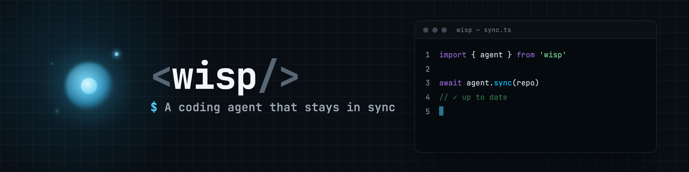

<p align="center">
  
</p>

# Wisp

[](https://www.python.org/)
[](https://docs.astral.sh/uv/)
[](https://docs.astral.sh/ruff/)

**A Python-native coding agent with CLI, JSON, RPC, and TUI interfaces.**

Wisp is an event-driven coding-agent runtime designed for local tool use, persistent
sessions, explicit approval flows, and embeddable integrations. The same core powers
interactive CLI use, machine-readable JSON output, long-lived RPC sessions, and the TUI.

Wisp uses Pi as a behavioral reference while implementing its runtime, safety model,
and extension surface in Python.

- **Event-driven** — agent activity is exposed as structured `WispEvent` streams.
- **Auditable** — provider-visible messages and key runtime events are persisted as JSONL.
- **Safe by default** — tools are opt-in, and mutating or command execution requires approval.
- **Embeddable** — a typed RPC client/controller provides a stable integration boundary.

> **Status:** Wisp is early-stage software. APIs and CLI behavior may change while the
> agent loop, session model, RPC layer, and TUI stabilize.
>
> Requires **Python 3.12+** and [`uv`](https://docs.astral.sh/uv/).

## Quickstart

```bash
uv sync
uv run wisp auth login openai-codex
uv run wisp -p "hello"
```

Wisp defaults to the `openai-codex` provider. For an offline smoke test that does not
require credentials, use the deterministic `fake` provider:

```bash
uv run wisp -p "hello" --provider fake
```

## Usage modes

Wisp runs the same agent core in four modes:

| Mode | Command | Output | Best for |
|------|---------|--------|----------|
| **Print** (default) | `wisp -p "…"` | Assistant text on stdout, events on stderr | One-shot prompts and shell workflows |
| **JSON** | `wisp -p "…" --mode json` | One `WispEvent` JSON object per line | Scripts and event consumers |
| **RPC** | `wisp --mode rpc` | JSONL commands in, `WispEvent` JSONL out | Long-lived integrations |
| **TUI** | `wisp tui` | Fullscreen Textual UI | Interactive development sessions |

## Providers & auth

Wisp supports five provider modes:

```bash
uv run wisp -p "hello" --provider openai-codex --model gpt-5.6-sol
uv run wisp -p "hello" --provider openai --model gpt-5.6-sol
uv run wisp -p "hello" --provider anthropic --model claude-sonnet-5
uv run wisp -p "hello" --provider google --model gemini-3.5-flash
uv run wisp -p "hello" --provider fake
```

- **`openai-codex`** (default) — use a ChatGPT Plus/Pro subscription via OAuth:

  ```bash
  uv run wisp auth login openai-codex
  ```

  Credentials are stored in `WISP_AUTH_FILE` (default `~/.wisp/auth.json`) with private
  permissions.

- **`openai`** — set `OPENAI_API_KEY`.
- **`anthropic`** — set `ANTHROPIC_API_KEY`.
- **`google`** — set `GOOGLE_API_KEY`.
- **`fake`** — a deterministic offline provider for tests and no-credential smoke runs.

Use `/model` with no arguments in the TUI to list every catalog model grouped by provider. If a
given model id belongs to only one registered provider, `/model <id>` switches the active provider
to match; otherwise use `/provider <name>` first.

Sessions persist to `~/.wisp/sessions` by default so transcripts survive across runs and can be
resumed. Set `WISP_SESSION_DIR` or pass `--session-dir` to store them elsewhere, including a
temporary path for ephemeral sessions.

## Tools and safety

Wisp includes built-in local tools for reading files, editing files, searching projects, and
running shell commands. File tools are sandboxed to the tool context's working directory by
default, and tools are exposed to the model only when enabled.

| Category | Tools |
|----------|-------|
| **Read** | `read` · `grep` · `find` · `ls` |
| **Mutating** | `write` · `edit` |
| **Command** | `bash` |

`bash` defaults to one-shot execution and reports stdout, stderr, truncation state, and exit code.
It also accepts `operation=start|poll|cancel` for commands that need a retained process handle;
those resumable updates return a `process_id`, terminal/running process state, incremental stdout
and stderr chunks, and stream-specific truncation metadata. The resumable controls remain under the
same command-tool safety category and approval policy.

**Print mode exposes no tools to the model unless you ask.** Read tools are enabled as a group;
mutating and command tools require per-tool opt-in:

```bash
uv run wisp -p "list files" --provider openai --allow-read-tools
uv run wisp -p "run tests"  --provider openai --allow-tool bash --yes
```

Because print mode is non-interactive, mutating and command tools are also blocked at execution
time unless you pass `--yes` (alias `--allow-unsafe-tool-execution`). Without it, the model
receives a clear tool error instead of Wisp executing the operation.

Wisp does not cap model/tool rounds by default, matching Pi's permissive agent loop. Pass
`--max-tool-iterations <n>` for a non-interactive fuse.

## Sessions

Wisp persists each run as a JSONL session and can continue an existing one:

```bash
uv run wisp -p "continue the work" --continue
uv run wisp -p "continue the work" --resume path/to/session.jsonl
uv run wisp -p "continue the work" --resume <session-id-prefix>
```

- `--continue` resumes the newest session in the active session directory.
- `--resume` accepts a JSONL path, filename, full session id, or unique id prefix.
- By default sessions live under `~/.wisp/sessions`. Use `--session-dir` or
  `WISP_SESSION_DIR` to override this location.

Session files contain provider-facing `message` entries plus selected structured `event` entries
(tool calls, approvals, tool start/end, errors) for audit. They do **not** persist
`message.delta` events. Continuation replays only the selected path's messages and compactions, so
audit events never become model-visible history, and stale project context from earlier turns is
not replayed as instructions. New v2 records form a parent-linked tree. An append-only active-leaf record selects
the root-to-leaf path used by continuation, so abandoned or cancelled work remains available in the
audit log without entering model context. Existing unversioned and v1 linear session files remain
readable through an in-memory compatibility decoder and are never rewritten during load. Persisted
events retain their raw payload and original event schema version, and are validated as typed events
only when requested.
The typed session API can also derive a new session without rewriting its source. A clone copies
the complete active path, while a fork copies the path before a selected user message and returns
that prompt for editing. Copied entries retain their stable IDs, parent links, timestamps, events,
compactions, and accounting metadata under a new session ID. These core operations are not yet
exposed as direct CLI or TUI commands; RPC clients can use `clone_session` and `fork_session`.
The former `wisp.agent.messages.SessionEntry(...)` constructor remains available as a deprecated
factory; new integrations should import the concrete entry models from `wisp.sessions`.

## Configuration

Wisp reads configuration from CLI flags, environment variables, and JSON settings files.

### Environment variables

| Variable | Purpose |
|----------|---------|
| `WISP_PROVIDER` | Provider name: `openai-codex`, `openai`, `anthropic`, `google`, or `fake` |
| `WISP_MODEL` | Model override; blank uses the provider default |
| `WISP_MODE` | Default mode; set to `tui` to open the TUI directly |
| `WISP_TUI_RENDERER` | TUI renderer: `line`, `fullscreen`, or `textual` |
| `WISP_SESSION_DIR` | Session storage directory; defaults to `~/.wisp/sessions` |
| `WISP_AUTH_FILE` | Auth file path; defaults to `~/.wisp/auth.json` |
| `WISP_RETRY_MAX_RETRIES` | Provider retry count; defaults to `2`, set `0` to disable |
| `WISP_RETRY_BASE_DELAY_SECONDS` | Initial retry delay; defaults to `0.5` |
| `WISP_RETRY_MAX_DELAY_SECONDS` | Maximum retry delay; defaults to `30` |
| `WISP_CONTEXT_RESERVE_TOKENS` | Tokens reserved outside the estimated input context; defaults to `16384` |
| `WISP_AUTO_COMPACTION` | Enable automatic threshold compaction and overflow recovery; defaults to `true` |
| `OPENAI_API_KEY` | Required only for the `openai` provider |
| `ANTHROPIC_API_KEY` | Required only for the `anthropic` provider |
| `GOOGLE_API_KEY` | Required only for the `google` provider |

### Settings files

For durable defaults, use a settings file instead of exporting every session. The user-level file
lives at `~/.wisp/settings.json`; a project may add `./.wisp/settings.json`, applied only after
you trust the project.

```json
{
  "provider": "openai",
  "model": "gpt-5.6-sol",
  "session_dir": "~/.wisp/sessions",
  "context_reserve_tokens": 16384,
  "auto_compaction_enabled": true,
  "retry": { "max_retries": 2, "base_delay_seconds": 0.5, "max_delay_seconds": 30 }
}
```

Configuration precedence, highest to lowest:

```text
CLI flag > environment variable > project ./.wisp/settings.json > user ~/.wisp/settings.json > built-in default
```

Never commit auth files or real API keys.

### Retry behavior

Retry settings are user-only, even in a trusted project: a repository cannot increase API spending
or prolong waits. Wisp retries only requests that fail before the provider starts streaming. It
uses bounded exponential backoff with small jitter, honors reasonable `Retry-After` requests, and
emits retry progress in JSON/RPC and the TUI. It never replays an already-started response.

> **Migration note:** Wisp no longer reads a project `.env` file. Move any values you kept there
> into your shell environment or `~/.wisp/settings.json`. A project `.env` on disk is still
> treated as a secret and is never surfaced to the model.

## Project trust

Project-local settings, context files (`AGENTS.md` / `CLAUDE.md`), and project extensions are
loaded only after the project is trusted. Untrusted projects can still be used, but Wisp ignores
their local configuration and instructions.

The first time you run Wisp in an untrusted directory it asks:

```text
Do you trust the files in /path/to/project?
```

Answer **yes** and the decision is remembered globally in `~/.wisp/trust.json`, keyed by resolved
path. Manage persisted decisions with:

```bash
uv run wisp trust status [path]   # trusted, untrusted, or undecided
uv run wisp trust allow [path]    # persistently trust a project
uv run wisp trust revoke [path]   # persistently mark a project untrusted
uv run wisp trust forget [path]   # remove the decision so Wisp can prompt again
```

Security notes:

- **Non-interactive runs** (CI, scripts, standalone RPC) default to untrusted. The interactive
  TUI asks before entering the interface. Set `WISP_TRUST=1` to opt in for one process, or
  `WISP_TRUST=0` to force untrusted mode.
- `WISP_TRUST` is read only from the real process environment, never from project files, and is
  not persisted.
- The `protected_paths` secret guard is user-only: a project settings file can never weaken it,
  even once trusted.
- `WISP_TRUST_FILE` may relocate the global trust store, but only to an absolute path outside the
  repository. A relative value is rejected.

## How Wisp builds context

Each turn sends a default coding-agent system prompt plus a bounded project-context message before
the user prompt. The context includes the working directory, git branch and capped status summary,
detected root files (`pyproject.toml`, `package.json`, `README.md`, …), tools exposed to the
model, and trusted project instructions from context files.

The default prompt also defines Wisp's workflow-completion contract. Remote freshness is verified
only when a task depends on current or refreshed remote state; local-only and offline work does not
fetch unconditionally. Completed checks are reported from their exit status, while failures,
timeouts, and checks that were not run remain distinct. A timeout is inconclusive rather than a
pass. Change and build tasks finish with a summary of the outcome, verification evidence, and
remaining uncertainty. Completed one-shot `bash` results expose their exit code directly to the
model; resumable `bash` operations expose their process handle and incremental output in typed
tool events while keeping the provider-visible result as ordinary tool output text.

Context files are loaded from the trusted context root down to the current working directory, with
parent instructions before nested ones. In each directory Wisp uses the first Pi-compatible match
in this order: `AGENTS.md`, `AGENTS.MD`, `CLAUDE.md`, `CLAUDE.MD`. Symlinked, protected, or
out-of-scope context files are skipped. Project instructions are bounded separately from the tool
list so large instruction files cannot hide the tools available to the model.

Project context is trust-gated. In untrusted projects, Wisp does not read local instruction files
or project settings. This is stricter than Pi's broader context loading, but keeps project
guidance inside the same trust boundary as project settings and future project extensions.

### Context accounting

Before each provider request, Wisp emits `context.estimated` with a deterministic approximation of
the system prompt, active messages, pending tool results, and tool schemas. The v1 estimator uses a
conservative `ceil(chars / 4)` heuristic. When the model catalog provides a context window, the
event also reports the configured reserve, estimated percentage, remaining input budget, and
whether the estimate has crossed that budget. Unknown models remain permissive and omit
window-dependent fields.

Provider-reported `usage.total_tokens` is kept separately as the authoritative observation for a
completed request. Session statistics sum provider totals exactly as reported, including
compaction summary requests; they never reconstruct `total_tokens` from input/output categories.
`context_reserve_tokens` is user-only, so a project settings file cannot reduce this safety margin.

After a completed prompt, automatic compaction uses a current provider `usage.total_tokens` when
available and otherwise falls back to the deterministic estimate. It triggers only when usage is
strictly greater than `context_window - context_reserve_tokens`; equality does not trigger.
Unknown model windows remain permissive, and automatic compaction stays disabled when the reserve
equals or exceeds the model window because no usable input budget remains. `auto_compaction_enabled`
is also user-only because automatic summaries make an additional provider request.

### Compaction

In the TUI, `/compact [instructions]` replaces older provider-visible turns with a structured
checkpoint while retaining the latest complete user turn verbatim. The summary request uses the
active provider, model, and effort without tools; optional instructions focus the checkpoint.
Compaction fails without changing replay if the model cannot produce a complete summary.

Compaction is append-only and intentionally lossy only at replay time. Original messages remain in
the session JSONL audit log, while subsequent prompts receive the checkpoint plus retained recent
context. Wisp never splits a tool call from its result.

Automatic threshold compaction is enabled by default and runs after a completed prompt when the
active context exceeds the reserved input budget. It uses the same validated summary and retains
the latest complete turn. If an automatic summary fails, Wisp preserves the completed prompt,
reports a failed threshold-compaction event, and leaves replay unchanged. Disable it with
`WISP_AUTO_COMPACTION=0` or `"auto_compaction_enabled": false` in user settings.
The interactive TUI also exposes `/context` for the current context budget, usage source, and
automatic-compaction eligibility. Use `/context auto on` or `/context auto off` to change the
setting for subsequent operations in the current process; this does not edit user settings.

When a provider explicitly rejects an input for context overflow, Wisp can compact and retry the
same prompt once. It preserves the append-only audit log, keeps completed read-tool results in
replay, and never appends the user prompt twice. Recovery is skipped after mutating or command
tools, or after text/thinking deltas have already reached an interface, because side effects and
partial responses cannot be safely repeated or retracted. A second overflow, unavailable
compactable prefix, cancelled summary, or failed summary follows the normal terminal error path
without another retry. Recovery also skips the normal threshold-compaction pass for that prompt to
avoid chaining automatic summaries; the next completed prompt resumes threshold evaluation.

## TUI

```bash
uv run wisp tui
```

A fullscreen Textual TUI built on the same RPC controller other integrations use. Its compact
Pi-style footer shows the current working directory/session plus status, queued follow-ups, and
provider/model. It also shows current context use: `ctx 12k/128k` is a current provider
observation, while `ctx ~12k/128k` is an explicit estimate (for example, immediately after
compaction). Automatic threshold and overflow summaries use the same progress notices as
`/compact` without changing the active prompt command. Completed tool cards include bounded
multiline output previews. The footer also shows cumulative catalog-based list-price estimates:
`cost $0.042` is complete accounting, while `cost ≥$0.042` includes unpriced historical or
unknown-model requests. Estimates are not invoices: subscription-backed Codex, custom pricing,
unknown models, and provider charges outside token usage remain unpriced. Adjust runtime settings
with slash commands instead of up-front flags. The prompt editor accepts multiline text: press Enter to submit, or
Shift+Enter / Ctrl+J to insert a newline. Pasted newlines are preserved.

Available slash commands:

```text
/help                       show commands
/auth [provider]            show credential status
/login [provider] [device-code]
/logout [provider]
/provider [provider]        switch provider for future prompts (resets model to default)
/model [model]              switch model for future prompts
/new                        start a fresh session and clear the screen
/resume [session-id]        browse or resume a persisted session
/compact [instructions]     summarize older context while preserving the JSONL audit
/context [auto on|off]      show or toggle compaction policy
/plan                       switch to read-only planning mode
/build                      switch to normal build mode
/history                    search prompts submitted in this TUI run
/quit, /exit
```

Slash command metadata is backed by Wisp's frontend-neutral runtime command descriptors rather
than a Textual-owned table. Built-in descriptor metadata now drives shared slash suggestions,
parsing, and RPC `get_commands` discovery. It does not yet add extension command handlers, dynamic
project extension loading, skills, prompt templates, package management, or configurable
keybindings.

`/new` preserves the current JSONL session for `/resume`, clears the active transcript and visible
terminal screen, and creates the next session lazily when another prompt is submitted. Provider,
model, effort, plan/build mode, tool permissions, trust, and compaction settings are retained.
Terminal-emulator scrollback may remain available even though the visible screen is cleared.

Plan mode applies to future prompts in the current process. It exposes only read-only tools that
were already authorized at startup (`read`, `grep`, `find`, and `ls` when selected); `write`,
`edit`, `bash`, and non-read extension tools are unavailable. Use `/build` to restore the original
authorized tool set. `Shift+Tab` toggles plan/build mode in the Textual and live fullscreen TUIs;
line input uses the slash commands. The selected mode is not persisted in session JSONL.

In the Textual TUI, press `Ctrl+R` or run `/history` to search up to 100 unique prompts
submitted during the current TUI process. Selecting a result restores its exact text to the
composer for editing and never submits it automatically. Exact duplicates move to the newest
position, and history remains available across in-process session switches. The history is
deliberately memory-only: Wisp does not write it to session JSONL, configuration, or a cache, and
resumed transcript messages are not imported into it. This avoids silently persisting additional
copies of prompts that may contain secrets. The line and fullscreen fallback renderers report
that searchable history requires the Textual TUI. Exact prompt text remains restorable, while the
case-insensitive search index is limited to the first 16,384 whitespace-normalized characters of
each entry so large pasted prompts cannot be rescanned in full on every search keystroke.

Pi's editor history is the behavioral reference: Pi records submitted user text and supports
cursor-key recall. Wisp intentionally uses a searchable overlay so Up/Down remain multiline
cursor controls in the composer. Durable prompt history, draft stashing, deletion controls, and
configurable retention remain future work.

In the Textual TUI, press `Ctrl+O` to open Wisp's searchable command palette. The palette and
inline `/` suggestions consume the same executable catalog loaded through RPC `get_commands`.
Selecting an action routes its canonical slash spelling through the existing TUI command handler,
so approval, trust, and active-operation restrictions remain unchanged. Opening or dismissing the
palette preserves the composer draft and transcript position. Textual's framework `Ctrl+P` palette
remains disabled. Dynamic availability reasons, suggested actions, configurable bindings, and
extension command handlers remain future work.

TUI login currently uses the `openai-codex` device-code flow; browser login is available from the
CLI (`uv run wisp auth login openai-codex`). `/model` with no arguments opens a model picker in
the Textual TUI and lists every catalog model grouped by provider in line mode. `/resume` with no
arguments opens the newest-first session picker in Textual and prints the same RPC-owned catalog
in line/fullscreen fallback modes; use `/resume <session-id>` there to select one directly.

### Model catalog

The packaged catalog lists current text-generation models that Wisp's streaming, client-tool
adapters can use. It intentionally excludes embeddings, image/audio/realtime-only models,
retired models, and access-restricted previews. Canonical models appear once in the picker;
documented aliases such as `gpt-5.6` and `gemini-flash-latest` remain valid configuration values.

Catalog entries are advisory rather than access control. Model access varies by account and region,
and explicitly configured unknown models continue to pass through to the selected provider. The
picker labels supported preview and legacy models. Catalog pricing is optional, effective-dated,
and provider-scoped; it is used only to estimate new request costs, which then retain their rate
snapshot in the session. Add account-specific models or negotiated rates in the user-only
`~/.wisp/catalog.toml` overlay; Wisp never reads a project-local catalog.

Unlike print mode, the interactive TUI exposes the **full tool registry by
default** — otherwise it would be a chatbot that can't read files or run
commands. Mutating and command tools (`write`, `edit`, `bash`) still pause for an
approval decision. Choose **approve once**, **allow this exact tool for the TUI
session**, **YOLO for all mutating/command tools in this TUI process**, or **deny**.
YOLO requires a second explicit confirmation and is never persisted. Pass `--yes`
to auto-approve from startup, or `--no-all-tools` to fall back to the opt-in
`--allow-read-tools` / `--allow-tool` filter.

Session and tool flags work with the `tui` command too:

```bash
uv run wisp tui --continue
uv run wisp tui --resume <session-id-prefix>
uv run wisp tui --no-all-tools                  # opt-in tool filter instead of the full registry
uv run wisp tui --no-all-tools --allow-read-tools
uv run wisp tui --yes                           # auto-approve mutating/command tools
uv run wisp tui --line          # simple line renderer, for fallback/debugging
```

On `--continue` or `--resume`, the TUI hydrates up to 500 active-path persisted
messages through the same RPC `get_messages` command available to other frontends before
it accepts new input. Text entries are restored as user/assistant transcript lines.
Persisted tool calls/results are restored as resolved tool cards when tool-result
presentation metadata is available; legacy sessions without that metadata still render a
generic historical card from the transcript message.

The in-TUI `/resume` flow uses the same typed `get_sessions`, `select_session`, and
`get_messages` RPC operations. A successful switch replaces the visible transcript instead of
mixing sessions, preserves any composer draft while the picker is open, and refreshes context and
cost statistics for the selected session. The catalog prefers durable session names and falls
back to session IDs. Like startup hydration, transcript restoration is bounded to the newest 500
active-path messages. This follows Pi's `/resume` picker behavior while keeping Wisp's filesystem
access and session mutation behind typed RPC events; `/session` remains available for a future
current-session information command.

The legacy `--mode tui` entrypoint remains for compatibility and honors
`--tui-renderer line|fullscreen|textual` plus `WISP_TUI_RENDERER`.

### Terminal capabilities

The Textual TUI targets truecolor terminals but degrades gracefully. 256-color and
16-color/ANSI terminals are handled automatically by Textual's own color-system
detection — no Wisp-specific configuration needed. Setting `NO_COLOR` (any value)
switches the whole interface to a deterministic grayscale rendering, inherited
automatically from Textual. Wisp is working toward every semantic state (approval,
denial, error, retry, tool status) carrying a non-color cue — a distinct glyph, text
label, or border form — so the interface stays legible and structurally correct with
color disabled; see the open accessibility issues for current coverage.

## Machine-readable output

Every outbound `WispEvent` includes `"schema_version": 26`; readers also accept legacy schema v5
through v25 events for compatibility. Schema v26 adds automatic-compaction policy metadata to
`session.stats` and `project.config.applied`. Schema v25 adds resumable `bash` process metadata to
`tool.execution.ended` and `tool.result`: `process_id`, `process_state`, `process_error`,
incremental `stdout`/`stderr`, per-stream truncation flags, and dropped-byte counts.

Schema v24 adds `rpc.session.tree.unreverted`, emitted after
`unrevert_session_tree` durably reverses the latest eligible explicit tree navigation. Session
entry schema v5 records whether an active-leaf transition came from navigation, unrevert, or
internal system recovery; v4 and older entries remain readable as system transitions.

Schema v23 adds `rpc.commands`, an immediate,
non-persisted command-registry snapshot returned by RPC `get_commands`. Each descriptor includes
stable names, user-facing slash spellings, aliases, category, argument metadata, display order, and
partial-enter behavior. This is discovery metadata only: command handlers, dynamic enabled state,
configurable keybindings, skills, templates, and extension lifecycle hooks remain separate work.

Pi's shared command surfaces are the behavioral reference. Wisp intentionally exposes typed
descriptor events over RPC and keeps execution/handler semantics out of this discovery slice.
Pi's shared slash-command discovery, configurable keybindings, and temporary selectors also inform
Wisp's TUI behavior; Wisp intentionally adds an OpenCode-style palette rather than claiming Pi has
this exact global surface.

Schema v22 adds optional `tool_result` presentation
metadata on RPC `get_messages` tool-message rows so TUI and RPC consumers can reconstruct
historical tool cards without replaying provider-visible history. A successful prompt follows this lifecycle (tool events
repeat inside a turn when the model requests tools):

```text
agent.started
  turn.started
    context.estimated
    provider.retrying *
    message.started
    message.delta *
    message.completed
    context.pressure ?
    tool.call -> tool.execution.started -> approval events -> tool.execution.ended -> tool.result
  turn.completed
queue.message.injected -> queue.updated ?
compaction.started ?
session.saved
compaction.completed ?
agent.completed
```

`message.delta` distinguishes `text` from `thinking` with `content_kind`.
`message.completed` carries the assembled content, finish reason, response id, and completed tool
calls. A failed provider response or tool loop emits `error`, a failed `turn.completed`, and a
failed `agent.completed`; it does not emit `message.completed` for an incomplete response.
The exception is successful schema-v11 overflow recovery: after `context.overflow`, Wisp emits
overflow compaction lifecycle events, then the failed `turn.completed`, and continues once. Its
`compaction.completed.will_retry=true` marks that failed turn as nonterminal; no `error` or
intermediate `agent.completed` is emitted unless compaction or the retry setup fails.

Schema v21 adds `rpc.session.name_changed` and nullable session display names on existing session
RPC state, catalog, selection, clone, and fork payloads. `set_session_name` appends a non-tree
metadata record; CR/LF runs are normalized to spaces, surrounding whitespace is trimmed, names are
limited to 256 UTF-8 bytes, and an empty normalized name clears the display name. Omitting
`session_id` renames the selected session and fails when none is selected. Supplying `session_id`
renames that persisted session without switching selection. Session-info metadata never changes
active leaf, replay, transcript pages, tree pages, or usage accounting.

Pi's `/name` and RPC naming behavior is the reference for user-visible display names. Wisp
intentionally exposes typed result events, optional explicit-session targeting, non-tree metadata
records, bounded normalization, and clone-only inheritance. Clones inherit the source's effective
name through a new target metadata record; forks start unnamed to avoid duplicate picker labels.

Schema v20 adds `rpc.session.tree` and `rpc.session.tree.navigated`. `get_session_tree` returns
persisted message, event, and compaction nodes from the selected session in append order, including
inactive branches but excluding active-leaf state records. Pages use exposed entry IDs as
`after_entry_id` cursors. Each node carries stable parent/operation metadata and a UTF-8-safe
preview capped at 512 bytes; event previews expose only the event type, tool arguments are never
included, and compaction previews contain only the bounded summary.

`navigate_session_tree` matches Pi's edit-and-resubmit workflow within the current session file.
Selecting the current active node is a successful no-op. Selecting another user message activates
its parent and returns the exact, untruncated prompt as `editor_text`; selecting any other node
activates that node directly. The append-only active-leaf update and refreshed replay are applied
before the result event is emitted, and subsequent prompts retain the existing interrupted
tool-call repair. Cancellation is honored before mutation; once the durable selection begins it is
allowed to finish and reports success. Unlike Pi, this slice uses typed events, explicit optimistic
leaf validation, and bounded flat pages; it intentionally omits branch summaries, labels, and
extension lifecycle hooks.

`unrevert_session_tree` reverses only the latest changed `navigate_session_tree` operation. It
appends another active-leaf transition and remains available after restart. Non-tree session-name
metadata does not invalidate it, but any later message, event, compaction, system leaf transition,
or prior unrevert does. An unavailable or stale unrevert appends nothing.

Schema v19 adds `rpc.session.cloned` and `rpc.session.forked` for durable session derivation.
`clone_session` copies the selected session's complete active path, while `fork_session` copies
the path before one persisted user-message entry and returns that entry's exact, untruncated
prompt text for editing. Both commands atomically select the derived session before their result
event is emitted. Clones inherit the selected display name; forks start unnamed. Forking the first
user message selects a reserved empty session whose file is created by the next persisted prompt,
so it does not appear in `get_sessions` until then.

Pi's RPC `clone` and `fork` operations are the behavioral reference: they also replace the active
session and return editable text for a fork. Wisp intentionally uses typed result events with
stable source/target identities, entry counts, active-leaf metadata, and optimistic source-tree
validation. This RPC slice does not add Pi-style extension lifecycle hooks.

Schema v18 adds `rpc.sessions` and `rpc.session.selected` for RPC session picker/resume flows.
`get_sessions` returns bounded persisted session summaries — session id, path, updated timestamp,
entry count, active leaf, and nullable display name — plus the currently selected session identity
and name. `select_session` loads one persisted session through the same session-store resolution
used by resume flows and updates the active RPC session only after the load/replay succeeds.
Neither event includes message bodies; use `get_messages` after selection to read a bounded
transcript page.

Schema v17 adds `rpc.messages`, the bounded, non-persisted response to RPC `get_messages`. It reads
the selected session, or an explicitly requested session id/path/prefix, and returns active-path
message entries in chronological order. Results include stable entry metadata, message content,
tool-call/result metadata, usage/cost snapshots, content/tool-call truncation metadata, and a
`next_before_entry_id` cursor when older active-path messages remain. Persisted system messages are
included if they are on the active path, and message content plus rendered tool-call arguments are
UTF-8-clipped under per-field and aggregate page budgets. It is a persisted transcript query, so it
runs sequentially with prompts, compactions, and statistics reads rather than bypassing an active
operation.

Schema v16 adds `rpc.state`, the immediate, non-persisted response to RPC `get_state`. It reports
the applied provider, effective model, effort, auto-compaction setting, count-only queue summary,
selected session identity/name, and active command identity/cancellation state without reading
session files or exposing messages. The effective model is the configured override when present and
the provider default otherwise.

Schema v15 adds `queue.items.removed`, emitted by successful RPC `pop_queue` and `clear_queue`
commands with the exact removed text, queue kind, operation, and command id. The following
`queue.updated` remains the authoritative post-mutation state.

Schema v13 adds `queue.updated`, a typed snapshot of harness-owned steering and follow-up queues
and their independent drain modes. Queue text remains outside the durable transcript until the
harness injects it as an ordinary user message.

Schema v12 adds optional `cost` snapshots to successful `message.completed` and
`compaction.completed` events, plus a cumulative `session.stats.cost` summary. Costs are exact
Decimal calculations from provider/model catalog list prices selected when each request completed;
they are never reconstructed from newer catalog rates. `estimated_usd=null` marks an unpriced
request, and a session's `known_usd` is only complete when no usage record is unpriced. New durable
compaction records use schema v4 to retain that snapshot; v1-v3 records remain readable.

Schema v11 adds overflow compact-and-retry. Overflow lifecycle events use `reason="overflow"`;
an overflow `compaction.completed` has `will_retry=true` only after a durable replacement commits
and one continuation is scheduled. Recovery stays inside the originating prompt RPC envelope and
does not emit an intermediate `error` or `agent.completed` when the retry succeeds. Overflow
records use compaction schema v3, while v1/v2 records remain readable.

Schema v10 adds automatic threshold compaction. `compaction.started` and `compaction.completed`
carry `reason="manual" | "threshold"`; threshold starts include the triggering context budget.
Automatic compaction events stay inside the originating prompt RPC envelope and automatic summary
failure does not change an already completed prompt into a failed command. Durable threshold
records use compaction schema v2 while existing v1 manual records remain readable.
On successful automatic compaction, `session.saved` precedes `compaction.completed`; on a failed
automatic summary, the failed completion precedes the prompt's normal `session.saved` event.

Schema v9 adds `context.estimated` and `session.stats`. Estimates are derived, non-persisted request
snapshots. `session.stats` is returned by the RPC `get_session_stats` command and separates
lifetime provider usage from the current active-context budget.

Schema v8 adds `compaction.started` and `compaction.completed`, plus the typed RPC `compact`
command. Successful manual compaction appends one durable compaction entry and emits
`session.saved`; failures and pre-commit cancellation leave active replay unchanged. Lifecycle
events report counts and summary-request usage without duplicating the summary itself.

Schema v7 adds context-window signaling. When catalog metadata is available and a successful
request reports usage at or above 80% of the model's context window, Wisp emits
`context.pressure` after `message.completed`. A provider rejection recognized as a context overflow
emits `context.overflow`; schema v11 can then compact and retry once when the automatic recovery
preconditions are met. Original messages remain append-only in the session audit log.

Schema v6 adds optional provider-reported token usage to `message.completed`. The `usage` object
records input, output, and total tokens plus provider-supported cache and reasoning categories.
Schema v14 adds `queue.message.injected`, emitted when queued steering or follow-up text crosses
into the active transcript. Its original timestamp is retained so session persistence and every
frontend observe the same durable boundary. Schema v13 added `queue.updated`, which reports
immutable steering/follow-up snapshots and their independent drain modes.

Schema v5 adds `model.provider_auto_switched`, emitted during an RPC `configure` command
immediately before its `rpc.command.finished` when a model-only `/model <id>` request resolves
(via the model registry) to a provider other than the one currently active — it carries the
`command_id` it belongs to, the `provider` switched to, and the `model` that triggered the switch,
so a client tracking provider state client-side can resync instead of assuming its own explicit
`/provider` requests are the only way the active provider ever changes. Schema v4 adds an optional
`exit_code` (`int | null`) to `tool.execution.ended` and `tool.result`, carrying a shell-like
tool's process exit status for presentation; it is `null` for tools without exit-code semantics.
Schema v3 added `provider.retrying` before `message.started`, with the next attempt number,
bounded delay, retry reason, and optional HTTP status. All retain schema v2's explicit
turn/message lifecycle and tool ordering. JSON/RPC consumers should branch on `schema_version` and
reject versions they do not support; Wisp's typed RPC client does this automatically.

### JSON mode

```bash
uv run wisp -p "hello" --mode json
```

Writes each `WispEvent` as one JSON object per line on stdout — including `message.delta`, tool
lifecycle events, errors, and `session.saved`. Assistant text is not written as raw text in this
mode.

### RPC mode

For long-lived integrations, drive Wisp over JSONL-RPC on stdin/stdout:

```bash
printf '{"type":"prompt","prompt":"hello"}\n{"type":"shutdown"}\n' | uv run wisp --mode rpc
```

Commands (the `id` field is optional — Wisp generates one when omitted):

| Command | Effect |
|---------|--------|
| `{"id":"cmd-1","type":"prompt","prompt":"…"}` | Run one agent turn, streaming `WispEvent` JSONL |
| `{"id":"compact-1","type":"compact","instructions":"Focus on unresolved work"}` | Compact older context in the active session |
| `{"id":"stats-1","type":"get_session_stats"}` | Emit a derived `session.stats` snapshot |
| `{"id":"state-1","type":"get_state"}` | Emit an immediate in-memory `rpc.state` snapshot |
| `{"id":"commands-1","type":"get_commands"}` | Emit an immediate in-memory `rpc.commands` descriptor snapshot |
| `{"id":"messages-1","type":"get_messages","limit":200}` | Emit a bounded active transcript page |
| `{"id":"sessions-1","type":"get_sessions","limit":50}` | Emit a bounded persisted session catalog |
| `{"id":"select-1","type":"select_session","session_id":"…"}` | Select a persisted session for later RPC commands |
| `{"id":"clone-1","type":"clone_session"}` | Clone the selected active path and select the clone |
| `{"id":"fork-1","type":"fork_session","entry_id":"…"}` | Fork before a user message, select the fork, and return its prompt |
| `{"id":"tree-1","type":"get_session_tree","limit":200}` | Emit a bounded append-order page of the selected session tree |
| `{"id":"navigate-1","type":"navigate_session_tree","entry_id":"…"}` | Navigate in-file and optionally restore a user prompt for editing |
| `{"id":"unrevert-1","type":"unrevert_session_tree"}` | Reverse the latest eligible explicit tree navigation |
| `{"id":"name-1","type":"set_session_name","name":"Roadmap cleanup"}` | Rename the selected session; empty normalized names clear it |
| `{"id":"steer-1","type":"steer","content":"Use the other approach"}` | Queue text after the active assistant/tool batch |
| `{"id":"follow-1","type":"follow_up","content":"Then summarize"}` | Queue text for when the active run would otherwise stop |
| `{"id":"queue-1","type":"get_queue_state"}` | Emit the active or retained `queue.updated` snapshot |
| `{"id":"mode-1","type":"set_queue_mode","kind":"steering","mode":"all"}` | Set one active queue's drain mode |
| `{"id":"pop-1","type":"pop_queue","kind":"steering"}` | Remove the latest item from one active queue |
| `{"id":"clear-1","type":"clear_queue","kind":"follow_up"}` | Clear one active queue; omit `kind` to clear both |
| `{"id":"cancel-1","type":"cancel","target_id":"cmd-1"}` | Request cancellation of a running or queued operation |
| `{"id":"approval-1","type":"approval","call_id":"call-1","approved":true,"scope":"tool_session"}` | Approve/deny a pending tool request |
| `{"id":"trust-1","type":"trust","request_id":"req-1","trusted":true}` | Answer a project-trust request |
| `{"id":"cmd-2","type":"shutdown"}` | Exit cleanly |

Each command emits `rpc.command.started` / `rpc.command.finished` so clients can group the events
between them. Prompts, compactions, statistics reads, transcript reads, session catalog reads,
session selection, cloning, forking, tree reads, tree navigation, tree unrevert, and session
renaming run sequentially; `get_state`, `get_commands`, queue commands, `cancel`, `approval`, and `trust` are
handled while an operation runs. `get_state` and `get_commands`
preserve the active command and any queued commands, including during prompt startup, compaction,
statistics reads, transcript reads, session operations, approval/trust waits, and after
cancellation is requested. During prompt startup,
queue commands buffered before prompt readiness are projected into the reported queue modes and
pending counts without draining the buffer. `get_state` reports coherent in-memory state only: use
`get_session_stats` for persisted entry, message, usage, context, and cost statistics, and
`get_messages` for bounded persisted transcript pages. `get_commands` reads the in-memory runtime
command registry, including extension-registered descriptors, and never reads session files or
executes a command handler. `get_messages` defaults to the selected
session and returns an empty page with null session fields before any session is selected; pass
`session_id`, `limit` (`1..500`), and `before_entry_id` to read a specific page without switching
the selected session. `get_sessions` accepts `limit` (`0..200`, default `50`) and never switches the
selected session. `select_session` accepts a non-empty session id/path/prefix, preserves the
previous selection on failure, and makes later selected-session reads use that session's active
leaf. `set_session_name` accepts a string `name` and optional non-empty `session_id`; omitted
`session_id` targets the selected session, while explicit IDs rename a persisted session without
switching. Empty normalized names clear the display name. The result is emitted only after the
selected-session cache is updated when the selected session was renamed. `clone_session` and
`fork_session` require a selected session and atomically replace it only after the derived session
validates. The source remains append-only and unchanged. Derivation cancellation is honored before
its durable store operation begins; after publication starts, the operation completes rather than
reporting a cancelled command that already created a session.
`get_session_tree` accepts `limit` (`1..500`, default `200`) and `after_entry_id`; it returns an
empty snapshot with null session fields before selection and an identified empty snapshot for a
reserved unpersisted session. `navigate_session_tree` requires a selected persisted session.
Failures leave the coordinator history and prior active leaf unchanged. Successful navigation
emits `rpc.session.tree.navigated` only after refreshed history is active, so later `get_messages`
and prompts immediately use the selected path. `unrevert_session_tree` uses the same selected-
session, optimistic-leaf, cancellation, replay-refresh, and append-only guarantees. It emits
`rpc.session.tree.unreverted` with the source navigation transition and restored leaf.
`get_queue_state` is safe
while idle. Queue mutations require an active run that is still accepting messages and otherwise
fail with `CodingSession has no active agent run`. Successful queue commands emit the authoritative
`queue.updated`; `pop_queue` and `clear_queue` first emit `queue.items.removed` with the exact
removed text. Pop removes the latest item for an edit-and-requeue workflow, while clear results
preserve FIFO order. Wisp uses its native `content`, unified queue-kind commands, and
`one_at_a_time` spelling; Pi compatibility aliases are not accepted yet. The shared harness caps
the combined steering and follow-up backlog at 100 pending messages; additional enqueue commands
fail without changing either queue.
A prompt may emit threshold compaction events before its `rpc.command.finished`; this does not
create a nested `compact` RPC command.
When an allowed mutating/command tool needs approval, Wisp emits `tool.approval.requested` with a
`call_id`; respond with an `approval` command carrying that `call_id`, a boolean `approved`, and an
optional approval `scope`: `once` (the default), `tool_session` (the exact tool name for this RPC
process), or `all_session` (all mutating/command tools for this RPC process). Scoped denials are
rejected. An optional `reason` describes a denial. When an undecided project needs trust, Wisp emits `trust.requested` with a
`request_id`; respond with a `trust` command carrying that `request_id`, a boolean `trusted`, and an
optional denial `reason`. Denials are remembered unless the command includes `"transient": true`
(for example, a UI closing before the user answered). Cancellation is best-effort. Provider, model,
tool-exposure, approval, session, and max-iteration flags apply to the whole RPC process.

### Typed RPC client

Python integrations can skip hand-rolling JSONL and use the typed controller — the intended stable
integration layer:

```python
from wisp.events import RpcCommandFinished
from wisp.rpc import JsonlSubprocessRpcTransport, RpcController

transport = await JsonlSubprocessRpcTransport.start()
controller = RpcController(transport)
prompt_id = await controller.prompt("hello")
shutdown_id = None
try:
    async for event in controller.events():
        ...
        if isinstance(event, RpcCommandFinished) and event.command_id == prompt_id:
            shutdown_id = await controller.shutdown()
        elif (
            isinstance(event, RpcCommandFinished)
            and shutdown_id is not None
            and event.command_id == shutdown_id
        ):
            break
finally:
    await controller.close()
```

`RpcController` exposes typed `prompt`, `compact`, `get_session_stats`, `get_state`,
`get_commands`, `get_messages`, `get_sessions`, `select_session`, `clone_session`,
`fork_session`, `get_session_tree`,
`navigate_session_tree`, `set_session_name`, `steer`, `follow_up`, `get_queue_state`,
`set_queue_mode`, `pop_queue`, `clear_queue`, `cancel`, `approve`, `configure`, and `shutdown`
methods and yields parsed `WispEvent` objects.

### In-process Python SDK

Python hosts that do not need process isolation can drive the same command/event contract directly:

```python
from wisp.config import WispConfig
from wisp.events import RpcCommandFinished
from wisp.sdk import InProcessOptions, InProcessWisp

# `startup_trusted=True` is an explicit trusted decision made by this host.
controller = await InProcessWisp.start(
    WispConfig(provider="fake"),
    options=InProcessOptions(startup_trusted=True, allow_read_tools=True),
)
prompt_id = await controller.prompt("hello")
shutdown_id = None
try:
    async for event in controller.events():
        render(event)
        if isinstance(event, RpcCommandFinished) and event.command_id == prompt_id:
            shutdown_id = await controller.shutdown()
        elif isinstance(event, RpcCommandFinished) and event.command_id == shutdown_id:
            break
finally:
    await controller.aclose()
```

`InProcessWisp` has the same typed command methods and `WispEvent` stream as `RpcController`; it
uses the same command host, agent loop, JSONL sessions, approval policy, project-trust gate, and
runtime cleanup as RPC. It does not import terminal/TUI code or expose mutable `CodingSession`
internals. It currently requires AnyIO's `asyncio` backend because built-in process tools use
asyncio subprocesses; use JSONL RPC from other async backends. Consume `events()` from exactly one
task and drain it while commands run. Tools are not exposed by default; `allow_read_tools`,
`allowed_tools`, or `all_tools` control exposure, while mutating/command tools still require
`approve()` unless `approve_unsafe_tools=True` is selected.

For normal environment/settings resolution, use `InProcessWisp.from_environment(...)`. It applies
only pre-existing safe trust decisions at startup; an undecided project emits `trust.requested`,
which the host answers with `trust()`, before project-local configuration is applied.

## Development

The coding runtime is split into explicit inward-facing layers:

```text
CLI / JSONL-RPC / SDK adapters -> RPC command host -> CodingSession -> AgentHarness -> run_agent_loop
```

`wisp.coding.session.CodingSession` owns project prompts, persistence, trust state, tool policy,
and application event publication. The transport-independent RPC command host owns command
scheduling, approval/trust responses, selected-session state, and configuration transitions.
`AgentHarness` owns the in-memory transcript and cancellation, while `run_agent_loop` remains
independent of sessions and frontends. The TUI consumes the same runtime through RPC events.

Within the Textual frontend, presentation state has explicit, inward-facing owners:

```text
TuiShell / RPC state
        ↓
TextualTuiRenderer ──→ TextualHistoryController
        ↓                     ↓
     TextualTui orchestration ─→ mounted transcript/history widgets
        ├──→ TextualInputController      → prompt history / compact echoes
        ├──→ TextualOverlayController    → structural overlay/viewport surfaces
        ├──→ TextualTranscriptController → ToolCard / WorkingIndicator widgets
        └──→ MarkdownStreamController    → StreamMessage widget
```

The shell owns agent, session, provider, and approval decisions. `TextualTuiRenderer` translates
typed events and owns event-order/progress bookkeeping; `TextualTui` routes framework events and
coordinates cross-controller session replacement. `TextualInputController` owns the process-local
input queue, recall history, and compact-paste echoes. `TextualOverlayController` owns overlay
visibility, composer focus, stale-input barriers, and temporary viewport snapshots.
`TextualHistoryController` owns the bounded persisted-history window, while
`TextualTranscriptController` owns only live card/activity/unseen-output presentation state.
`MarkdownStreamController` remains the owner of asynchronous Markdown writes.

Widgets retain rendered content and widget-local interaction state. Controllers do not import the
shell, RPC, provider, session, or agent runtime; history and input controllers additionally avoid
concrete widgets through structural surfaces. The app is the only owner of Textual mounting/layout
restoration, and no controller moves runtime or approval policy into the UI.

Providers yield typed events from `wisp.providers`. A stream may emit zero or more
`ProviderRetrying` events before exactly one `ProviderResponseStarted`, followed by zero or more
text/thinking deltas and completed tool calls, then exactly one `ProviderResponseCompleted` or
`ProviderResponseFailed`. The agent rejects retries after start, missing or duplicate terminal
boundaries, post-terminal events, and mismatched tool-call summaries. Configuration and
request-opening failures may raise before the start event; after a response starts, adapters
normalize expected transport and provider failures into a failed terminal event. Use
`ScriptedProvider` to exercise deterministic multi-turn and failure cases without a live model.

```bash
uv sync            # install
uv run pytest      # test
```

The test suite runs against the deterministic `fake` provider, so the agent core, CLI, and JSONL
sessions can be exercised without API keys or network access.
