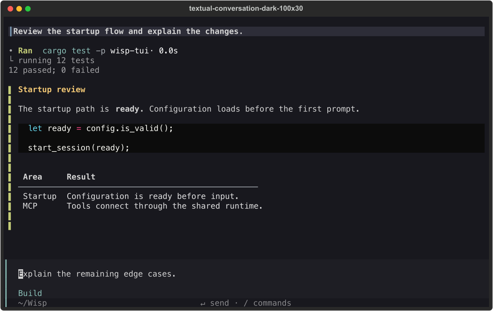
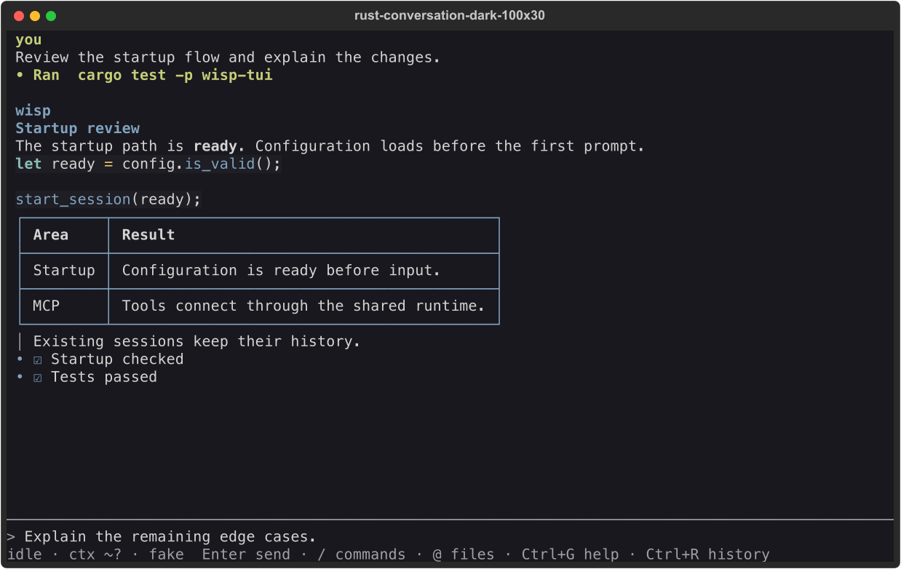
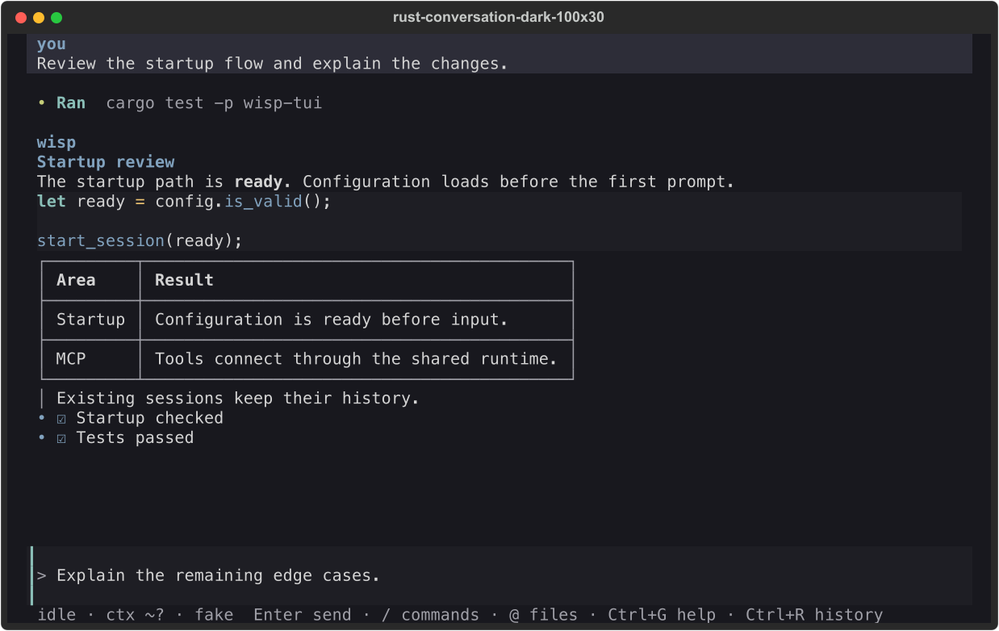

# Rust conversation refinement

These captures use the same synthetic conversation from
[`tui_visual_conversation.json`](../../../tests/fixtures/tui_visual_conversation.json).
Rust captures exercise `LiveUi::draw` with Ratatui's `TestBackend`; Textual captures
exercise its renderer and `App.run_test`. No model, MCP server, or saved session is used.
The Rust baseline is `bbeb0b7` (merged PR #559), captured before the styling changes.

## Main comparison, 100 × 30

Textual reference:



Rust before:



Rust after:



The comparison covers spacing, speaker hierarchy, tool emphasis, code and user
backgrounds, and the composer. Existing differences in folding and scroll behavior
remain: Textual displays short tool output by default, while Rust starts collapsed.
These are visual review artifacts, not pixel-equality assertions across renderers.

## Other states

| Capture | Review focus |
| --- | --- |
| [Light](after-light.png) | Text and surface contrast |
| [Monochrome](after-mono.png) | Hierarchy without chromatic cues |
| [80 × 24](after-80x24.png) | Normal terminal height and footer budget |
| [40 × 16](after-40x16.png) | Wrapped prompt, sticky identity, compact transcript |
| [Approval at 30 × 8](approval-30x8.png) | Minimum supported decision surface |
| [Selected, expanded tool](selected-tool.png) | Selection contrast and output hierarchy |
| [Working at 80 × 24](working.png) | Partial reply, editable steering, activity indicator |

## Reproduce

From the repository root:

```sh
WISP_VISUAL_OUTPUT=/tmp/wisp-tui-captures cargo test -p wisp-tui capture_conversation_screens -- --ignored
uv run python -m benchmarks.tui_visual_capture /tmp/wisp-tui-captures --textual
```

This emits 48 Rust JSON buffers and SVGs: conversation, expanded tool, working,
and approval at 100 × 30, 80 × 24, 40 × 16, and 30 × 8 in dark, light, and monochrome.
It also emits 16 Textual SVG references at the two larger sizes in dark and light.
The working indicator is fixed at its first frame; animation is covered by the
existing runtime tests. The committed PNGs were rasterized with `rsvg-convert`:

```sh
rsvg-convert /tmp/wisp-tui-captures/rust-conversation-dark-100x30.svg -o /tmp/wisp-tui-after.png
```

The exporter preserves each terminal cell's position, so spaces, wide characters,
and table borders do not depend on SVG text-run spacing. Fonts still depend on the
viewer's installed monospace fonts. Geometry and style regressions are checked in
Rust buffer tests; mouse, queue, and terminal lifecycle behavior are checked over PTYs.
