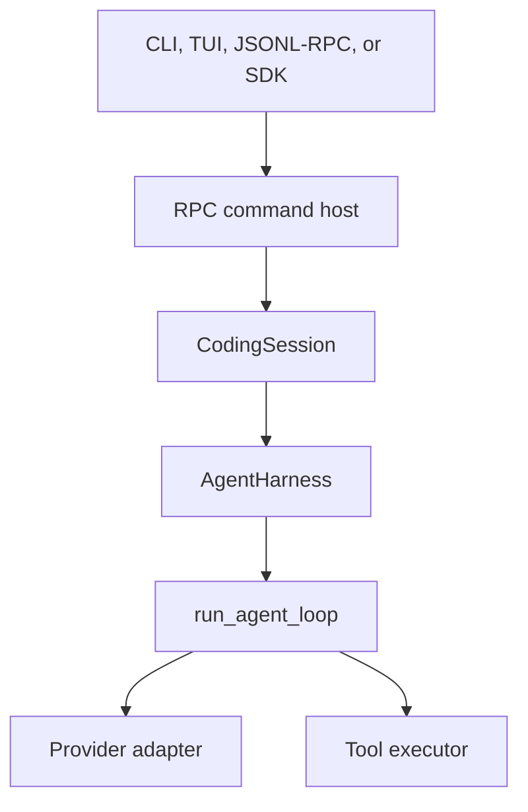
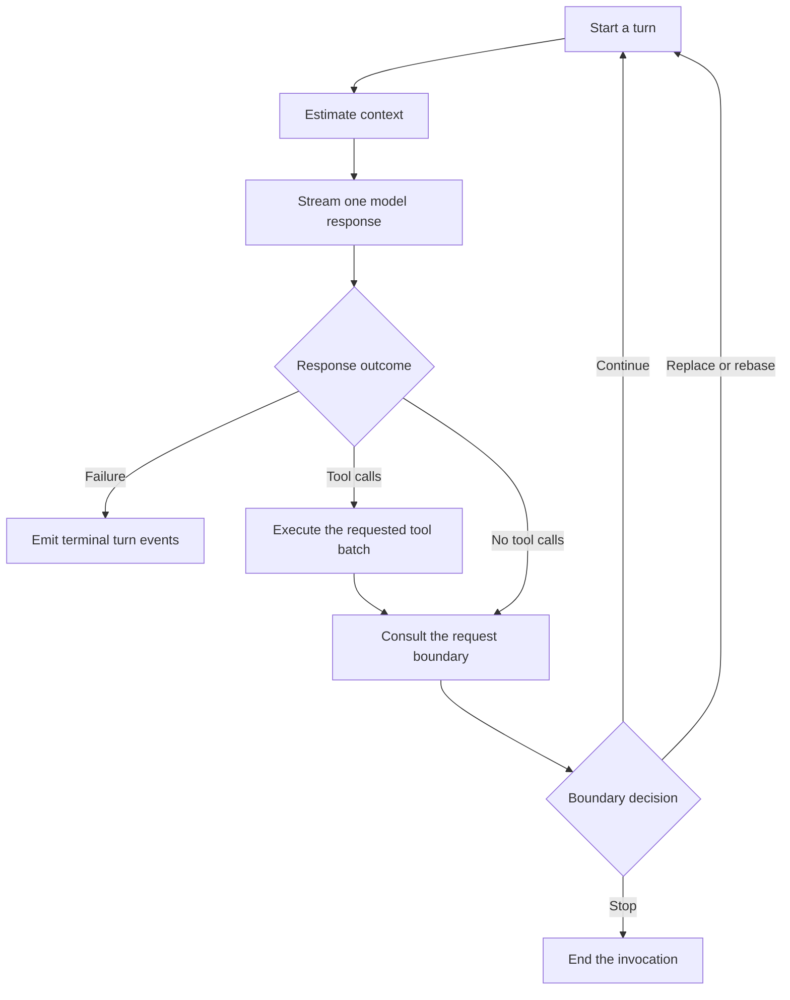

# Agent runtime

Wisp separates the stateful agent harness from the provider-neutral agent loop. The split keeps
conversation policy and durable session concerns out of the model/tool cycle while giving every
interface the same runtime behavior.



## Ownership at a glance

| Layer | Owns | Does not own |
| --- | --- | --- |
| `run_agent_loop` | One invocation's turns, provider streaming, context estimates, tool batches, and continuation state | The conversation between invocations, persistence, compaction policy, or frontend behavior |
| `AgentHarness` | The in-memory transcript, steering and follow-up queues, cancellation, and coordination around one live invocation | Durable storage, trust and safety policy, or provider-specific protocol behavior |
| `CodingSession` | Persistence, compaction orchestration, project context, trust, safety policy, and cost accounting | Provider/tool control flow or frontend rendering |
| RPC command host and interfaces | Command scheduling, transport adaptation, and rendering typed events | Independent copies of agent policy |

The practical rule is to change behavior in the narrowest layer that owns it. Provider-native
request and replay behavior stays in the provider adapter even when the loop consumes it.

## The agent loop

`run_agent_loop` is an async event stream. It receives a portable base history and an
`AgentLoopConfig`, then repeats a provider/tool cycle until cancellation, failure, a limit, or a
request-boundary decision stops it.



One **turn** is one provider response plus its requested tool batch, if any. `TurnCompleted` closes
that turn; it does not necessarily end the loop invocation. The loop keeps only transient
continuation state:

- the provider's native response cursor, when supported;
- tool results and extra user messages waiting for the next request;
- assistant and tool rows produced during the current invocation;
- turn and tool-iteration counters.

The input `messages` sequence is not mutated. Persistence and the transcript used by a later
invocation remain the caller's responsibility.

### Request boundaries

After a successful turn, the loop asks an optional request-boundary hook what the next request
should use:

| Decision | Effect |
| --- | --- |
| `stop` | End the invocation. This takes precedence over other fields. |
| `extra_messages` | Add plain user messages to the next continued request. |
| `messages` | Use a fresh portable history and discard native continuation state. |
| `context_rebase` | Replace the portable base while retaining the accepted native continuation tail. |

Context-overflow recovery uses the same decision model through a separate hook. Decisions are
validated centrally so unsupported structured-history transitions are rejected instead of being
silently flattened for a provider.

## The harness

`AgentHarness` persists an in-memory conversation across calls to `prompt()`, `prompt_message()`, and
`continue_()`. It constructs a loop configuration for each live invocation and projects completed
assistant messages and tool results into its transcript as events arrive.

```mermaid
sequenceDiagram
  participant Session as CodingSession
  participant Harness as AgentHarness
  participant Loop as run_agent_loop

  Harness->>Loop: Start with normalized provider history
  Loop-->>Harness: Stream message and tool events
  Harness->>Harness: Append completed transcript rows
  Loop-->>Harness: TurnCompleted
  Harness->>Harness: Drain an eligible queue and arm the boundary
  Loop->>Harness: Request the next-boundary decision
  Harness->>Session: Ask for session policy when configured
  Session-->>Harness: Stop, continue, replace, or rebase
  Harness-->>Loop: Return the decision
  Loop-->>Harness: Start the next turn
  Harness->>Harness: Apply any accepted transcript transition
```

The boundary handshake deliberately separates two kinds of state:

- The loop applies a decision to the request it is preparing.
- The harness applies the corresponding transcript replacement when the next turn starts.

This keeps the provider-visible request and harness-visible transcript synchronized without letting
the loop mutate conversation state owned by its caller.

### Queued messages

The harness has two FIFO queues with a shared capacity:

- **Steering** is considered after every completed turn and has priority over follow-up messages.
- **Follow-up** is considered only when a turn has no tool calls and the run would otherwise stop.

Each queue can inject one message at a time or its current snapshot as a batch. Messages added after
a batch is selected wait for a later boundary. Cancellation and stream closure do not inject queued
messages that were never exposed through queue events.

The harness permits one live invocation. While it is running, callers use steering or follow-up
rather than starting an overlapping prompt.

## Navigating the implementation

### `wisp.agent.loop`

| Module | Responsibility |
| --- | --- |
| `runner.py` | Top-level turn lifecycle, context estimation, and provider/tool orchestration |
| `model_response.py` | Provider stream adaptation, lifecycle validation, and completion metadata |
| `tool_execution.py` | Tool scheduling, approvals, protocol validation, and cancellation settlement |
| `continuation.py` | Native cursor, pending request data, and request-boundary transitions |
| `config.py` | Provider-neutral dependencies, limits, hooks, and cancellation contracts |

Start with `run_agent_loop` in `runner.py`, then follow only the phase you need.

### `wisp.agent.harness`

| Module | Responsibility |
| --- | --- |
| `runner.py` | Transcript updates, queues, cancellation, and loop-event orchestration |
| `boundaries.py` | Session-policy preparation and synchronized transcript transitions |
| `config.py` | Harness dependencies, runtime limits, and queue policy |

Start with `AgentHarness._run` in `runner.py` for the complete orchestration path.

The source directories also contain contributor-focused
[loop](https://github.com/whanyu1212/Wisp/blob/main/src/wisp/agent/loop/README.md) and
[harness](https://github.com/whanyu1212/Wisp/blob/main/src/wisp/agent/harness/README.md) READMEs
with local change and test maps.

## Contracts to preserve

Runtime event order is observable through the SDK, RPC, persistence, and frontends. In particular:

- every started turn has exactly one terminal `TurnCompleted`;
- completed tool executions emit `ToolExecutionEnded` immediately before the matching
  `ToolResultReady`;
- approval events are ordered request, resolution, then terminal result;
- steering drains before follow-up, with FIFO order within each queue;
- interrupted tool exchanges are repaired before the next provider request;
- optional provider capabilities are detected rather than assumed.

Focused assertions for these contracts live in `tests/agent_runtime.py` and
`tests/test_agent_runtime_invariants.py`.
