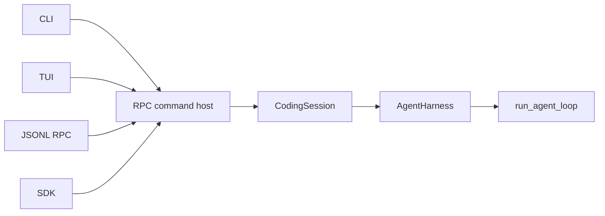

# Architecture

How Wisp is put together, and why. This section explains design decisions; the
[Reference](../reference/) documents exact surfaces.

The single most important idea: **every interface drives the same agent loop.** Shared session,
approval, cancellation, and event contracts live below the frontends, while each frontend exposes
only the live controls its transport can support. See
[Staying in sync](../guide/staying-in-sync) for those interface differences.

Each layer adds one concern:

- `run_agent_loop` owns the provider/tool cycle and remains provider-neutral.
- `AgentHarness` owns the in-memory transcript, queues, and continuation of a run.
- `CodingSession` adds durable state, compaction, trust, and safety policy.
- The RPC command host exposes those capabilities as typed commands.
- CLI, JSONL-RPC, SDK, and TUI adapters translate their transports into the shared commands and
  render typed events back to users.

This boundary keeps persistence and frontend concerns out of the provider loop, while allowing
provider adapters to preserve their own request, replay, continuation, and usage semantics.

## Terminal frontend boundary

Textual is Wisp's current interactive terminal frontend and remains supported. Wisp has accepted an
experiment to add an optional Rust terminal frontend over the same Python JSONL-RPC runtime. The
experiment changes presentation ownership, not runtime authority: Python continues to own providers,
tools, trust, approvals, sessions, configuration, and every durable or safety-sensitive decision.

The [Rust terminal frontend boundary](./rust-tui-boundary) records the process topology, subsystem
ownership, migration map, compatibility rules, failure ownership, and evidence gates. Rust is not a
shipped or default interface until later implementation and rollout decisions satisfy those gates.

## Resumed transcript hydration

The Textual TUI completely hydrates the selected session's active path after an explicit interactive
`/resume`. Startup hydration and non-Textual renderers remain bounded. This is an intentional UX
tradeoff: a long session takes longer to select, but upward scrolling no longer crosses asynchronous
page-mount boundaries that can change scroll geometry underneath the reader.

Complete does not mean one top-level widget per JSONL record. The RPC layer returns every message and
every nested tool-call identity, with bounded text and argument previews. The TUI verifies that every
active-path message row survives conversion, then groups request/result pairs into tool cards and all
observations of one managed process into a single lifecycle card. System and empty assistant rows get
explicit transcript representations instead of disappearing. Mounting occurs in responsive batches
behind a progress overlay and the replacement becomes visible only after layout settles.

Process cards retain the IDs and bounded one-line previews of every represented update. Expansion
renders only a fixed-size timeline window; selecting an update performs an exact, active-path
`get_messages` lookup for that row. This avoids eagerly duplicating potentially large stdout bodies in
both the session snapshot and widget tree. The costs are an O(rows) metadata read, conversion, and
retention during `/resume`, plus detail-fetch latency on the first inspection of an output row. Exact
lookup bypasses frontend preview limits but preserves the persisted tool-level `truncated` marker,
because bytes discarded before JSONL persistence cannot be reconstructed.

Session identity and row identity are validated again when an exact-detail response arrives. Pending
lookups are invalidated on `/new` or another `/resume`, so a late response cannot populate a card from
the wrong session. Pagination cursor repetition, duplicate rows, omitted row representations, and
mount failures abort the committed hydration rather than exposing a partial transcript.
