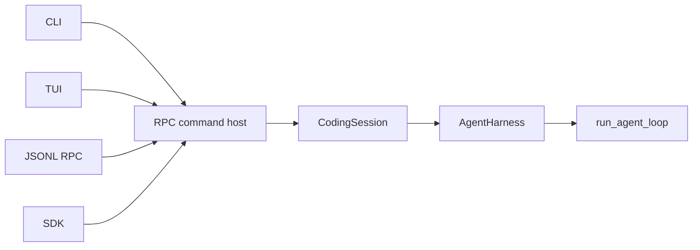

# Architecture

How Wisp is put together, and why. This section explains design decisions; the
[Reference](../reference/) documents exact surfaces.

The single most important idea: **every interface drives the same agent loop.**
That is what makes the sync guarantees in
[Staying in sync](../guide/staying-in-sync) hold everywhere — steering, approvals,
and cancellation live in the shared core, so no frontend can drift from them.

- [Layer stack](./layers) — what each layer owns, and what it must not know about.
- [Event model](./events) — why events are the contract.
- [Safety model](./safety) — trust, tool categories, protected paths.
- [Extensions](./extensions) — registering providers, tools, and commands.
- [TUI internals](./tui) — the pure-RPC-client design and its controllers.
