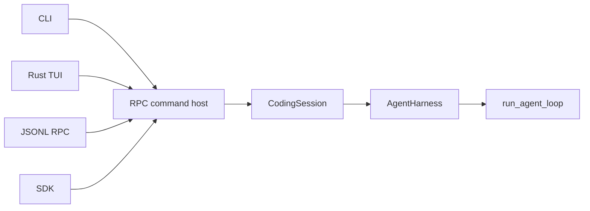

# Architecture

How Wisp is put together, and why. This section explains design decisions; the
[Reference](../reference/) documents exact surfaces.

The single most important idea: **every interface drives the same agent loop.** Shared session,
approval, cancellation, and event contracts live below the frontends, while each frontend exposes
only the live controls its transport can support. See
[Staying in sync](../guide/staying-in-sync) for those interface differences.

Each layer adds one concern:

- `run_agent_loop` owns the provider/tool cycle and remains provider-neutral.
- `AgentHarness` owns the in-memory transcript, queues, and continuation of a run.
- `CodingSession` adds durable state, compaction, trust, and safety policy.
- The RPC command host exposes those capabilities as typed commands.
- CLI, JSONL-RPC, SDK, and TUI adapters translate their transports into the shared commands and
  render typed events back to users.

This boundary keeps persistence and frontend concerns out of the provider loop, while allowing
provider adapters to preserve their own request, replay, continuation, and usage semantics.

See [Agent runtime](./agent-runtime) for the loop and harness lifecycles, ownership boundaries,
request-boundary handshake, and source navigation.

## Terminal frontend boundary

`wisp`, `wisp tui`, and `wisp --mode tui` launch the Rust frontend. Native wheels for macOS arm64 and Linux glibc 2.28+ x86_64 bundle its
binary. A pure-wheel install keeps the Python backend and non-TUI interfaces, but interactive startup
fails with instructions to obtain a native wheel or build a matching Rust binary. Source checkouts
use an absolute `WISP_RUST_TUI_BINARY` override.

See the [Rust terminal frontend boundary](./rust-tui-boundary) for the RC2 decision and ownership.

## Resumed transcript hydration

The Rust TUI loads the selected session's entire saved active path at startup and after interactive
`/resume`, projecting it once in chronological order; transport and rendering caches remain bounded.
This is an intentional UX tradeoff: long sessions take more time and memory to load, but users can
scroll through the saved conversation without a history cap. The RPC layer pages through every saved
message in chronological order. Rust builds its retained transcript after all pages arrive; rendering
caches and tool previews remain bounded. Exact persisted tool output is fetched on demand when a
preview was clipped.
