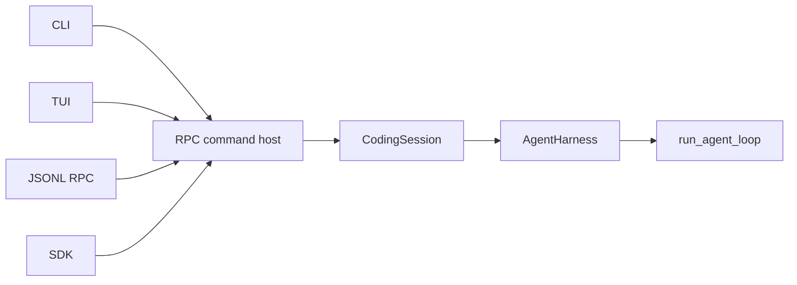

# Architecture

How Wisp is put together, and why. This section explains design decisions; the
[Reference](../reference/) documents exact surfaces.

The single most important idea: **every interface drives the same agent loop.** Shared session,
approval, cancellation, and event contracts live below the frontends, while each frontend exposes
only the live controls its transport can support. See
[Staying in sync](../guide/staying-in-sync) for those interface differences.

Each layer adds one concern:

- `run_agent_loop` owns the provider/tool cycle and remains provider-neutral.
- `AgentHarness` owns the in-memory transcript, queues, and continuation of a run.
- `CodingSession` adds durable state, compaction, trust, and safety policy.
- The RPC command host exposes those capabilities as typed commands.
- CLI, JSONL-RPC, SDK, and TUI adapters translate their transports into the shared commands and
  render typed events back to users.

This boundary keeps persistence and frontend concerns out of the provider loop, while allowing
provider adapters to preserve their own request, replay, continuation, and usage semantics.
