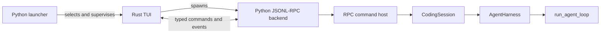

# Rust terminal frontend boundary

| Field | Decision |
|---|---|
| Current frontend policy | Rust is the sole interactive terminal frontend; pure installs retain non-TUI interfaces |
| Runtime boundary | Rust owns terminal presentation; Python owns agent semantics and durability |
| Historical decision | RC2 Rust-default trial on 2026-09-16; see [RC2 checklist](../contributing/rc2-release.md) |

`wisp`, `wisp tui`, and `wisp --mode tui` launch Rust; `auto` and `rust` are equivalent selectors.
Native wheels for macOS arm64 and Linux glibc 2.28+ x86_64 bundle the binary. Pure-wheel installs
retain print, JSON, RPC, and SDK interfaces but report an actionable missing-binary error for
interactive startup. Source development uses a matching binary selected by an absolute
`WISP_RUST_TUI_BINARY` path.

> Rust decides how frontend state is presented. Python decides what is allowed, what is durable,
> and what commands and events mean.

## Process topology

The Python launcher resolves the exact native executable, passes the Python interpreter
and backend command, and remains alive as an external supervisor. Rust owns input, rendering,
backend protocol exchange, and graceful shutdown. The launcher restores terminal state and cleans up
the shared process group if Rust exits abruptly. Missing or incompatible binaries fail startup with
guidance; the launcher does not select another terminal renderer.

## Subsystem ownership

| Area | Owner | Frontend boundary |
|---|---|---|
| Agent loop, providers, tools, MCP, and managed processes | Python | Rust receives typed events; it does not execute tools or decide provider policy. |
| Harness transcript, steering, follow-ups, and cancellation | Python | Rust projects authoritative run and queue state. |
| Durable sessions, replay, compaction, and branching | Python | Rust requests snapshots through RPC; it never reads JSONL files. |
| Trust, protected paths, approvals, and credentials | Python | Rust collects input and presents decisions, but Python validates and stores them. |
| Model catalog, configuration, project-file discovery, and updates | Python | Rust renders backend-provided state and sends typed requests. |
| Terminal input, composer, overlays, layout, scrollback, and themes | Rust TUI | Presentation state is disposable and cannot change backend policy. |
| CLI print/JSON, RPC, and SDK interfaces | Python | These interfaces use the same runtime without depending on Rust presentation. |
| Binary selection and fail-safe process cleanup | Python launcher | Rust attempts graceful cleanup; the launcher enforces the process boundary. |

## Wire boundary and compatibility

The live boundary carries typed commands, events, capability snapshots, bounded previews, and
explicit user prompts or answers. It never gives Rust direct ownership of session JSONL, credential
files, provider SDK objects, tool executors, or approval policy. Python reads historical session
formats and projects current-version data for Rust.

The Rust frontend and Python package are exact-version peers. Generated Rust transfer types follow
the committed live schema; the launcher and handshake reject package or RPC protocol mismatch
before ordinary interaction. The current live contract is RPC v9; events carry no separate schema
version. Historical
schema bundles remain immutable; see [Compatibility and versioning](../reference/compatibility.md).

## Lifecycle and failure ownership

| Failure or transition | Owner and outcome |
|---|---|
| Missing, corrupt, or incompatible Rust binary | Python launcher reports an actionable non-zero error with installation or source-build guidance. |
| Backend spawn or protocol failure | Rust stops accepting commands, restores the terminal, and reports failure; launcher verifies process cleanup. |
| Rust panic, abort, or abrupt termination | Launcher restores a known terminal baseline and terminates the supervised process group within a deadline. |
| Normal quit or signal | Rust requests graceful backend shutdown; launcher enforces the cleanup deadline. |

The Rust frontend bounds handshake, event admission, shutdown, and task joins. Neither frontend
ownership nor backend EOF alone is treated as a fail-safe cleanup guarantee.

## RC2 decision history

The RC2 release PR authorized a Rust-default trial on native-wheel installations. It
supersedes the default hold in [#470](https://github.com/whanyu1212/Wisp/issues/470) for this candidate
only. Textual was retained as the selectable fallback during that trial. The subsequent retirement
replaced that fallback with the existing prompt-toolkit fullscreen renderer. The later Rust-only
retirement removed the Python terminal renderers; neither change moved the agent runtime to Rust.
The RC2 trial did not itself publish a stable release.

The dated [RC2 checklist](../contributing/rc2-release.md) and
[acceptance evidence](https://github.com/whanyu1212/Wisp/blob/main/benchmarks/rust_tui_acceptance_evidence.md)
record the original migration gates. Later [interaction](https://github.com/whanyu1212/Wisp/blob/main/benchmarks/rust_tui_interaction_evidence.md)
and [memory](https://github.com/whanyu1212/Wisp/blob/main/benchmarks/rust_tui_memory_evidence.md)
measurements supersede its unmeasured performance questions. Those reports compare the former
Textual frontend with Rust under specific workloads; they do not describe a currently selectable
Textual renderer. Rust still retains full saved transcript history, with memory growing with session
size.

### Rust command interaction

The Rust frontend draws the virtual conversation and composer before clearing and painting the
active popup rectangle. Modal geometry does not resize the background transcript. The same derived
view priority controls painting and input, while individual views keep their existing asynchronous
state. Only the focused editor places the cursor. Existing redraw coalescing and bounded row caches
remain in effect; keeping the background current does not require continuous idle painting.

Approval/trust states dismiss ordinary inspection views and suppress retained connection/session
views until the decision settles. Backend updates continue while a view is suppressed. Rendering
readiness is invalidated on actionable catalog changes, navigation, resize, and decision transitions,
so a hidden or replaced choice cannot be activated before it is drawn. At 30×8 a popup can occupy
the terminal; the compact decision layout below 11 rows retains its existing accessibility priority.

`/help` lists commands implemented by the Rust frontend, using the backend's descriptions and
ordering. Arrow keys and Page Up/Down scroll help; Escape or Ctrl+C closes it, and `r` refreshes
discovery. Unsupported catalog commands produce a notice when typed. Discovery runs in the
background; its failure does not block prompts or explicitly typed supported commands.

Typing a slash prefix opens completion above the composer. Up/Down selects a command; Tab or
Enter fills a partial command without executing it. Enter on an exact command executes it.
Completion preserves existing arguments. Escape dismisses completion; Shift+Enter and Ctrl+J
insert newlines. Multiline pastes and slash-prefixed prose remain prompt text. A lone unknown
slash word is treated as a command attempt, so `/tmp` reports an unknown command while
`/tmp/file` remains literal text. Commands are handled before steering and follow-up queues.

`/plan` and `/build` change the current process's mode only while idle. The header shows mode
after startup state discovery or successful configuration acknowledgement. `/quit`, `/exit`,
and `:q` exit through normal backend shutdown, including cancellation of active work.
