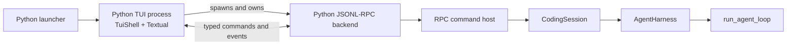
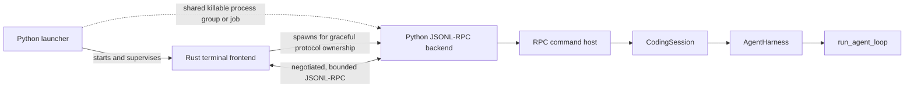

# Rust terminal frontend boundary

| Field | Decision |
|---|---|
| Status | RC2 Rust-default trial on native-wheel installations; Textual maintained |
| Date | 2026-09-16; supersedes the September 3 #470 hold for this RC |
| Tracking | [#456](https://github.com/whanyu1212/Wisp/issues/456); [RC2 decision and release checklist](https://github.com/whanyu1212/Wisp/blob/main/site/contributing/rc2-release.md) |

In 0.2.0rc2, `wisp`, `wisp tui`, and `wisp --mode tui` use `auto`: prefer the Rust frontend
on macOS/Linux when the active installation declares its native binary, otherwise use Textual.
Native wheels cover macOS arm64 and Linux glibc 2.28+ x86_64. Pure/source installs, Intel macOS, and
other platforms keep Textual. Explicit CLI selection takes precedence over `WISP_TUI_RENDERER`,
which takes precedence over `auto`. `WISP_RUST_TUI_BINARY` also selects Rust in auto mode on
macOS/Linux for source development. Missing or damaged declared binaries and Rust launch/runtime
failures report an error; they never silently switch frontends.

Use `wisp tui --renderer textual` or `WISP_TUI_RENDERER=textual` for the maintained Python
fallback. Textual keeps compatibility and critical fixes; new frontend work prioritizes Rust.
Both clients use the same Python runtime, permissions, providers, and saved sessions.

The governing rule remains:

> Rust decides how frontend state is presented. Python decides what is allowed, what is durable,
> and what commands and events mean.

## RC2 renderer decision

The RC2 release PR records explicit authorization to trial Rust as the installed-native default.
It supersedes the default hold in [#470](https://github.com/whanyu1212/Wisp/issues/470) for this
candidate only. Historical measurements in `benchmarks/rust_tui_acceptance_evidence.md` remain dated
evidence, not fresh performance claims. Platform installation checks, realistic long-session
measurements, terminal/accessibility feedback, and rollback remain part of release acceptance.
Textual removal and stable promotion require separate decisions. Packaging alone never authorized
this change; the release decision does.

## Context

The current Textual TUI already runs as a client of a separate `wisp --mode rpc` process. That
separation gives Wisp a useful migration seam: a Rust frontend can replace the latency-sensitive
terminal client without creating a second agent implementation.

Profiling behind [#270](https://github.com/whanyu1212/Wisp/issues/270),
[#418](https://github.com/whanyu1212/Wisp/issues/418), and
[#442](https://github.com/whanyu1212/Wisp/issues/442) attributes the largest recurring interactive
stalls to Textual layout and compositor work rather than provider execution or Markdown parsing.
The experiment therefore targets terminal presentation first. It is not evidence for rewriting
providers, tools, sessions, or the Python SDK.

Python remains the stronger ownership boundary for Wisp's semantic engine because the existing
runtime, provider integrations, extension model, public SDK, durability rules, and safety controls
are already typed and extensively tested there. Moving those concerns would multiply risk without
addressing the measured terminal bottleneck.

## Process topology

### Current Textual path

The current frontend process also contains several responsibilities that cannot be copied safely
into Rust: model-catalog derivation, credential operations, protected-path-aware file indexing, and
update operations. Those become backend capabilities or launcher responsibilities before the Rust
frontend reaches parity.

### Implemented optional Rust frontend path

The Python launcher remains the trusted entrypoint. It resolves the selected renderer and Rust
executable, supplies the exact Python interpreter and opaque `wisp --mode rpc` backend command, and
runs preflight before terminal handoff. RC2 native wheels include the executable; pure/source
installations can supply an absolute `WISP_RUST_TUI_BINARY` for development.

On macOS and Linux, the launcher starts Rust in a new process group and transfers the foreground
terminal to it. Rust spawns the Python backend in that inherited group, owns negotiated protocol
shutdown, and restores its raw-mode and alternate-screen changes. The Python launcher remains alive
as the external supervisor. On every exit path it checks and, if necessary, signals the entire
process group, then restores the original foreground process group, termios attributes, and a known
ANSI terminal baseline. Backend stdin reaching EOF is not treated as a cleanup guarantee. Windows
is rejected before binary resolution; no Windows supervision path is implemented.

Textual remains a separate, supported path through the same Python runtime. Explicit Rust selection
that cannot start because the binary is missing, incompatible, or fails during negotiation returns
an actionable non-zero error. It does not silently substitute Textual. Users can explicitly select
Textual. #470 closed without authorizing automatic fallback.

## Subsystem ownership

| Area | Authoritative owner | Frontend boundary |
|---|---|---|
| Agent loop and provider/tool continuation | Python | Rust receives typed lifecycle events only. |
| Harness transcript, steering, follow-ups, and cancellation state | Python | Rust projects authoritative queue and run state. |
| Durable sessions, branching, replay, and compaction | Python | Rust requests bounded current-version snapshots and never reads session JSONL. |
| RPC scheduling and command semantics | Python | Rust correlates command IDs but does not reinterpret command policy. |
| Providers, model execution, usage, and retries | Python | Rust presents sanitized catalog and lifecycle data. |
| MCP discovery and execution | Python | Rust presents typed status and tool events. |
| Tools and managed processes | Python | Rust renders calls and results; it never executes or supervises tools. |
| Trust and protected paths | Python | Rust solicits an explicit answer and sends it for authoritative validation. |
| Approval policy and scopes | Python | Rust cannot infer safety or approve a different call ID. |
| Authentication storage and refresh | Python | Rust accepts masked input and submits secrets through a dedicated command. |
| Effective provider/model/effort catalog | Python | Rust builds pickers from an authoritative snapshot. |
| Runtime and project configuration | Python | Rust displays effective state and sends typed configuration requests. |
| Project-file discovery | Python | Rust receives bounded, relative, policy-filtered suggestion data. |
| Update check and installation capability | Python | Rust presents notices, choices, progress, and restart guidance. |
| CLI print/JSON modes and Python SDK | Python | They remain independent supported interfaces. |
| Frontend reducer and command correlation | Rust | State is disposable and reconstructable from local actions plus RPC events. |
| Terminal input, resize, mouse, paste, and clipboard presentation | Rust | No runtime or safety policy is inferred from terminal input. |
| Frame pacing, rendering, scrolling, selection, and overlays | Rust | Rendering may coalesce eligible presentation work, never control semantics. |
| Markdown, syntax, diff, and tool-card presentation | Rust | All untrusted data is bounded and terminal-sanitized. |
| Themes, keymaps, layout, and other presentation preferences | Rust | Preferences cannot alter backend behavior or become session authority. |
| Rust binary selection and backend command construction | Python launcher | Rust does not discover an arbitrary interpreter or rebuild trusted arguments. |
| Invocation supervision and fail-safe cleanup | Python launcher and OS supervision primitive | Rust attempts graceful shutdown; the launcher terminates the shared process group or job when Rust cannot unwind. |
| Textual TUI | Maintained Python fallback | Default without a native binary; explicitly selectable everywhere. Rust failures do not select it automatically. |

## Migration map for the current TUI

This map classifies responsibilities, not files. The Rust frontend should not reproduce the Python
module graph or translate Textual widgets line by line.

| Current responsibility | Current location | Target disposition |
|---|---|---|
| Preflight, trusted configuration, backend argv/environment, renderer selection, external supervision | `tui/launch.py`, `tui/app.py` | Retain in the Python launcher. Add a shared killable process boundary for Rust and its backend without moving trust resolution into Rust. |
| Input/event coordination, command correlation, visible status, pending local submissions | `tui/shell.py`, `tui/state.py` | Reimplement as a terminal-independent Rust reducer driven by local actions and typed events. Python queue/run state remains authoritative. |
| Session catalog, selection, history hydration, paging, detail lookup | `tui/shell.py`, `tui/history.py` | Port client correlation and viewport projection. Continue loading and validating durable state through Python RPC. |
| Slash-command parsing and command catalog | `tui/commands.py`, `tui/shell.py` | Rust owns local dispatch and presentation; executable command metadata comes from Python. Local-only actions such as help and theme remain frontend-owned. |
| Model lookup, ambiguity handling, effort filtering, selection persistence | `rpc/configure.py`, provider catalog, settings | Rust renders the backend catalog and requests persistence through `configure`; Python applies and saves resolved selections. Textual retains its existing persistence path. |
| Credential status, API-key persistence, disconnect, device-code login | `tui/auth_commands.py`, `tui/connections.py` | Move behind the secure Python contract in #461. Rust owns masked entry and progress presentation only. |
| Protected-path-aware snapshots and local path ranking | `project_files.py`, `rpc/project_files.py`, `tui/file_index.py` | Shared Python traversal now serves `get_project_files`; Rust ranks safe relative paths locally and does not walk the workspace. |
| Update checking, install capability, and update execution | `tui/update_commands.py`, `wisp.update_check` | Keep Python-owned. Rust `/update [check|install]` shows external instructions without network/install/restart. Automated notices and coordinated binary install/update/rollback remain #469. |
| Terminal lifecycle, composer, overlays, pickers, mouse, focus, resize | Textual app, controllers, and widgets | Reimplement behavior in Rust. Do not port Textual private APIs, CSS, widget identity, or compositor workarounds. |
| Streaming cadence, transcript window, history viewport, card identity | Textual stream/history/transcript controllers | Reimplement bounded client-side state in Rust and validate semantic behavior with #459 traces. |
| Markdown, tool output, file results, process cards, and diffs | TUI presentation helpers and widgets | Reimplement bounded presentation from structured events. Execution and process lifecycle remain Python-owned. |
| Themes, theme persistence, keybindings, prompt-history search | TUI preference and input modules | Keep frontend-local and disposable. Any new persistent prompt-history policy requires separate privacy and lifecycle design. |
| Privacy-safe render and input-latency diagnostics | `tui/diagnostics.py` and benchmarks | Implement frontend-specific instrumentation with comparable scenarios, never content-bearing telemetry. |
| Line and legacy fullscreen renderers | `tui/rendering.py`, `tui/live.py` | Keep Python-only. No Rust parity requirement is implied. |
| Textual implementation and regression suite | `src/wisp/tui`, TUI tests | Retain as a maintained fallback and behavioral evidence. Removal requires a separate decision. |

## Wire-boundary rules

The live boundary permits only typed, bounded, JSON-serializable data required for frontend
interaction:

- current-version command envelopes, events, capability snapshots, and command results;
- explicit user prompts, queue actions, approval/trust answers, and configuration intents;
- bounded transcript, tool, process, catalog, status, and suggestion projections;
- relative display-safe project metadata that has already passed backend policy;
- a dedicated client-to-backend secret command for credentials, with redaction requirements.

The following never become Rust-owned data sources:

- session JSONL files or historical event schemas;
- credential files, refresh tokens, or provider SDK objects;
- project configuration files used to derive trust or protected paths;
- tool executors, managed subprocess handles, or approval policy;
- Python extension instances, MCP clients, or arbitrary in-process objects.

Secret-bearing commands are one-way submissions. Raw API keys, access tokens, and refresh tokens
must not be echoed in results or events, retained in prompt history, persisted in sessions, included
in fixtures, or written to logs and diagnostics.

## Live protocol and durable compatibility

The live frontend protocol and durable session formats are separate compatibility domains. The
Rust frontend is exact-lockstep rather than range-compatible:

- Python models are the source of truth for the live command and event schema.
- The committed schemas generate Rust data-transfer types at compile time; Rust types are not a
  handwritten second schema.
- The Python package/runtime is `0.2.0rc2` and the `wisp-tui` crate is `0.2.0-rc.2`. The launcher
  passes the Python version to Rust, which translates Cargo prerelease spelling to Python spelling
  and checks exact equality before spawning the backend. The backend repeats its Python package
  version in the handshake. This spelling conversion does not permit different release versions.
- The only accepted live contract is RPC protocol v8 with event schema v39 and no negotiated
  capabilities. The frontend consumes current live event output, including backend-owned
  connection-catalog snapshots, and never reads credential files itself.
- A package, protocol, or event-schema mismatch fails before ordinary terminal interaction. The
  Rust frontend does not negotiate older live contracts.
- Python retains backward parsing, migration, and replay of persisted session and event versions.
- Rust receives current-version snapshots after Python has loaded historical data. It never needs
  implementations for old persisted schemas.

The committed v8 schema manifest and generated projections define the current handshake fields,
frame limits, strict event variants, and UTF-8 JSON representation. See
[Compatibility and versioning](../reference/compatibility) for Wisp's durable contracts.

## Lifecycle and failure ownership

| Failure or transition | Required owner and outcome |
|---|---|
| Rust binary missing or incompatible | The Python launcher reports an actionable non-zero failure for Rust selection. Textual remains explicitly selectable, but is not selected automatically. |
| Backend spawn failure | Rust restores the terminal and reports the sanitized failure; the launcher verifies the supervised boundary is empty and exits non-zero. |
| Protocol version mismatch | Negotiation fails before ordinary commands or terminal interaction; neither side continues optimistically. |
| Backend exits or stdout closes | Rust stops accepting commands, preserves any bounded partial presentation, restores the terminal, and reports truthful status. |
| Broken stdin pipe | Rust treats the backend as unavailable, stops writes, and begins bounded cleanup. |
| Rust panic, abort, or abrupt kill | Rust cleanup is best-effort only. The launcher observes the exit, restores a known terminal baseline, and terminates the shared process group or job within a fixed deadline, including the backend. |
| Interrupt, termination signal, or normal quit | Rust attempts terminal restoration and graceful backend shutdown. The launcher enforces the cleanup deadline and propagates a truthful outcome. |
| Failed update or restart | Python reports failure without leaving a mixed-version process pair. The user retains an explicit Textual path. |
| Textual failure | Existing Python cleanup and RPC ownership remain unchanged by the Rust experiment. |

The Rust frontend implements bounded handshake, graceful shutdown, task join, and
signal-escalation deadlines. It does not rely on frontend destructors or backend EOF for fail-safe
cleanup, transfer semantic authority, or permit unbounded cleanup.

## Feature-parity matrix

Reconciled on **2026-09-12** from main
[`a7cc3a3`](https://github.com/whanyu1212/Wisp/commit/a7cc3a376b26dbfb5b80a6f071274d77418d5f6b),
through [#548](https://github.com/whanyu1212/Wisp/pull/548), plus the #467 daily-use readiness changes
in this tree. The [acceptance inventory](https://github.com/whanyu1212/Wisp/blob/main/benchmarks/rust_tui_daily_use_readiness.md) records
focused evidence and remaining gates; it is not a comparative benchmark or broad hardening pass. The September 3 measurements in
`benchmarks/rust_tui_acceptance_evidence.md` remain historical evidence.

**Implemented** means the feature and its focused regression coverage are present in this tree; it does not
certify every terminal or workload. **Accepted RC difference** records a limitation with the
Textual fallback available. **Stable-promotion evidence** remains required before declaring broad
support. **Deferred noncritical** features do not block this RC trial.

| Surface | Current Rust behavior | Evidence / remaining gate |
|---|---|---|
| Prompts, approvals, trust, cancel, steering and follow-up queues | Implemented | Foundations in [#464](https://github.com/whanyu1212/Wisp/issues/464) and [#466](https://github.com/whanyu1212/Wisp/issues/466); pressure and lifecycle acceptance remains #468 |
| Virtual Markdown, tool-card, and structured-diff transcript | Implemented | [#465](https://github.com/whanyu1212/Wisp/issues/465); terminal-safety and pressure acceptance remains #468 |
| Bounded history paging, `/resume`, `/new` | Implemented | [#466](https://github.com/whanyu1212/Wisp/issues/466) |
| `/clone`, `/tree`, `/unrevert`, `/name` | Implemented in Rust; not exposed in Textual | [#466](https://github.com/whanyu1212/Wisp/issues/466); intentional frontend difference |
| `/connect` API-key and device-code flows | Implemented | [#497](https://github.com/whanyu1212/Wisp/pull/497); secret-lifecycle hardening remains #468 |
| Live RPC v8 / event schema v39 lockstep | Enforced at handshake | [Current contract](../reference/compatibility.md#live-jsonl-rpc-protocol); no older live-contract negotiation |
| Model/provider/effort selection | Backend-driven picker, typed commands, saved defaults | Implemented in [#538](https://github.com/whanyu1212/Wisp/pull/538) |
| `/help`, slash completion, `/plan`, `/build`, `/quit` | Backend command discovery, confirmed mode display, graceful exit | Implemented in [#539](https://github.com/whanyu1212/Wisp/pull/539) |
| `/init` project guidance | Discovered command dispatches the typed backend initialization workflow; Rust reuses normal trust, approval, cancellation, and transcript lifecycle | Implemented for [#569](https://github.com/whanyu1212/Wisp/issues/569); project inspection and create-only write policy remain Python-owned |
| Context/cost visibility and compaction | `/context`, automatic-compaction controls, `/compact` | Implemented in [#540](https://github.com/whanyu1212/Wisp/pull/540) |
| Skills and MCP status | Typed backend catalogs, skill insertion/completion, MCP status and refresh | Implemented in [#541](https://github.com/whanyu1212/Wisp/pull/541); MCP reconnect controls are outside this slice |
| Prompt-history search | `/history` and Ctrl+R restore exact prompts; bounded and process-local | Implemented in [#542](https://github.com/whanyu1212/Wisp/pull/542); not persisted history or transcript search |
| Transcript-preserving popups | Conversation drawn first, focused popup last; decisions preempt popups | Implemented in [#545](https://github.com/whanyu1212/Wisp/pull/545); minimum-size popups can cover the conversation |
| Protected-path-aware file suggestions | Python snapshot RPC; Rust fuzzy/tree picker inserts references without reading files | Implemented in [#544](https://github.com/whanyu1212/Wisp/pull/544) and [#546](https://github.com/whanyu1212/Wisp/pull/546); [#462](https://github.com/whanyu1212/Wisp/issues/462) is closed |
| Themes and presentation preferences | Shared palettes and `tui.json`, preview/apply/cancel, Ctrl+T, `NO_COLOR` | Implemented in [#547](https://github.com/whanyu1212/Wisp/pull/547); does not implement configurable bindings |
| Mouse navigation | Wheel scrolling, row selection, outside-click dismissal, composer cursor positioning | Implemented in [#548](https://github.com/whanyu1212/Wisp/pull/548); enabled by default; approval/trust decisions remain keyboard-only |
| Configurable actions and keybindings | Implemented in Rust; stable IDs, user-only overrides, resolved hints and Ctrl+G help | #445 / #467; Textual retains its existing binding engine |
| Update notice/install/restart UX | Rust `/update [check\|install]` provides external instructions; Textual retains its integrated flow | Explicit alternative for #467; automatic notices and coordinated binary install/update/rollback remain [#469](https://github.com/whanyu1212/Wisp/issues/469) |
| Essential layout, editing, and focus acceptance | Consolidated feature regressions plus configured-input/help/paste launcher PTYs | #467 acceptance inventory; broad adversarial and terminal coverage remains #468; decorative polish is deferred noncritical |
| Large-paste presentation | Compact markers with bounded display metadata; exact raw submission/history/queues | #467 editor, reducer, rendering and PTY regressions; historical replay stays raw |
| Composer clipboard | Native copy/cut/paste with an OSC52 copy fallback; selected Ctrl+C copies and otherwise retains cancellation | Clipboard failures preserve the draft; pasted text keeps editor sanitization and size limits |
| Transcript search and built-in drag selection/clipboard copy | Not implemented; terminal-native selection depends on terminal and mouse capture | Accepted RC difference; validate accessibility and copying workflows during the RC trial |
| Fuzz, backpressure, terminal/secret hygiene, fault recovery | Deadline-based FIFO admission, fair event/input turns, deferred-activation guards, bounded pressure/PTY cases, generated terminal-control properties, hostile live-payload PTY coverage, sanitization and shared traces | The #468 implementation is closed; newly reproduced safety/cleanup failures block RC acceptance. Broader field and platform evidence remains part of stable promotion. |
| Prebuilt binary distribution and install lifecycle | The tag-gated release flow assembles one pure fallback wheel plus native manylinux x86_64 and macOS arm64 wheels; installed Wisp resolves Rust only from its active Python environment | #566 adds post-download release-set verification, provenance, installed fake-provider smoke, native/pure replacement, offline reinstall, corruption and uninstall evidence; publication still requires an approved tag release |
| Windows | Rejected before binary resolution | Accepted RC difference; not a claimed Rust target |
| No automatic fallback to Textual | Explicit Rust failures remain errors; Textual is explicitly selectable | Intentional policy from [#470](https://github.com/whanyu1212/Wisp/issues/470) |
| Comparative PTY input-to-frame vs Textual and supported opt-in feedback | No matched dual-renderer PTY evidence or supported rollout recorded | Remaining stable-promotion evidence under [#456](https://github.com/whanyu1212/Wisp/issues/456); RC2 is an explicitly authorized trial |

Transport pressure evidence is recorded in
[`benchmarks/rust_tui_transport_pressure.md`](https://github.com/whanyu1212/Wisp/blob/main/benchmarks/rust_tui_transport_pressure.md).
The transport budgets cover queued encoded bytes and a bounded pending frame. RC2 retains all
conversation entries and loads complete saved history. It collects raw pages, then projects them
once with temporary historical correlation indexes; live indexes and rendering caches remain
bounded. Total transcript memory grows with history size. There is no whole-process RSS ceiling.

Protocol hardening also includes fixed-seed raw-wire and JSONL framing properties, canonical
fixture/seed replay, and bounded AddressSanitizer fuzz campaigns for client and server wire
decoding. See the [fuzzing instructions](https://github.com/whanyu1212/Wisp/blob/main/fuzz/README.md)
for budgets, manual extended runs, and failure reproduction. These checks cover protocol parsing
and logical frame buffering. Deterministic renderer properties and a built-binary hostile-payload
PTY cover representative terminal/Unicode injection paths; secret lifecycle, recovery races,
dependency auditing and broader process-memory evidence remain part of the RC2 and stable-promotion
checklist.

#468 and #469 are closed; #566 carries the production distribution follow-up. Completing release
integration does not itself authorize supported opt-in, a default switch, or Textual deprecation. Optional
experience improvements under [#237](https://github.com/whanyu1212/Wisp/issues/237), including draft
stash, activity views, and the separate image-attachment roadmap, are not automatic parity blockers.

## Relationship to existing work

- [#270](https://github.com/whanyu1212/Wisp/issues/270) owns evidence-based Python/PyO3
  acceleration candidates. Native Python acceleration is not part of the Rust TUI boundary.
- [#399](https://github.com/whanyu1212/Wisp/issues/399) keeps the Python SDK a supported product
  surface rather than treating Python as an internal implementation detail.
- [#405](https://github.com/whanyu1212/Wisp/issues/405) and the RPC capability issues should share
  model, authentication, and settings semantics instead of creating frontend-only policy.
- [#409](https://github.com/whanyu1212/Wisp/issues/409) coordinates package boundaries and any
  evidence-based lightweight distribution decision.
- [#418](https://github.com/whanyu1212/Wisp/issues/418) keeps Textual reliable as the supported
  fallback; broad Textual-only restructuring is deferred.
- [#442](https://github.com/whanyu1212/Wisp/issues/442) supplies the near-term Textual input-latency
  baseline used for a later comparison.
- [#443](https://github.com/whanyu1212/Wisp/issues/443) remains a Textual synchronized-frame
  experiment rather than a prerequisite for Rust.
- [#445](https://github.com/whanyu1212/Wisp/issues/445) supplies stable action identifiers and
  Rust-local keymaps without sharing renderer implementation.
- [#468](https://github.com/whanyu1212/Wisp/issues/468) and
  [#469](https://github.com/whanyu1212/Wisp/issues/469) are closed. [#566](https://github.com/whanyu1212/Wisp/issues/566)
  carries their production distribution follow-up without reopening the #470 renderer decision.
- [#470](https://github.com/whanyu1212/Wisp/issues/470) is the closed decision to remain at
  experimental opt-in with Textual as default.

## Consequences and reconsideration

RC2 accepts the maintenance cost of two frontend languages and exact package/protocol lockstep.
The release pipeline verifies native and pure artifacts, provenance, and installation lifecycle;
publication and installation from PyPI must still be verified after tagging. Local and candidate CI
checks cannot establish published availability.

The [release checklist](https://github.com/whanyu1212/Wisp/blob/main/site/contributing/rc2-release.md)
records the remaining platform, long-session, comparative-performance, accessibility, and feedback
work. Regressions in startup, terminal restoration, session integrity, or critical controls block
promotion. Users can select Textual explicitly while failures are investigated. Textual removal and
stable promotion remain separate decisions.

### Rust command interaction

The Rust frontend draws the virtual conversation and composer before clearing and painting the
active popup rectangle. Modal geometry does not resize the background transcript. The same derived
view priority controls painting and input, while individual views keep their existing asynchronous
state. Only the focused editor places the cursor. Existing redraw coalescing and bounded row caches
remain in effect; keeping the background current does not require continuous idle painting.

Approval/trust states dismiss ordinary inspection views and suppress retained connection/session
views until the decision settles. Backend updates continue while a view is suppressed. Rendering
readiness is invalidated on actionable catalog changes, navigation, resize, and decision transitions,
so a hidden or replaced choice cannot be activated before it is drawn. At 30×8 a popup can occupy
the terminal; the compact decision layout below 11 rows retains its existing accessibility priority.

`/help` lists commands implemented by the Rust frontend, using the backend's descriptions and
ordering. Arrow keys and Page Up/Down scroll help; Escape or Ctrl+C closes it, and `r` refreshes
discovery. Unsupported catalog commands produce a notice when typed. Discovery runs in the
background; its failure does not block prompts or explicitly typed supported commands.

Typing a slash prefix opens completion above the composer. Up/Down selects a command; Tab or
Enter fills a partial command without executing it. Enter on an exact command executes it.
Completion preserves existing arguments. Escape dismisses completion; Shift+Enter and Ctrl+J
insert newlines. Multiline pastes and slash-prefixed prose remain prompt text. A lone unknown
slash word is treated as a command attempt, so `/tmp` reports an unknown command while
`/tmp/file` remains literal text. Commands are handled before steering and follow-up queues.

`/plan` and `/build` change the current process's mode only while idle. The header shows mode
after startup state discovery or successful configuration acknowledgement. `/quit`, `/exit`,
and `:q` exit through normal backend shutdown, including cancellation of active work.
