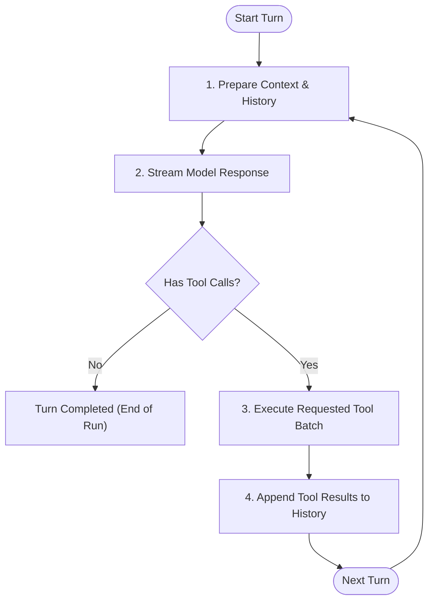
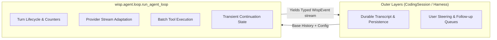

# Chapter 1: The Core Loop — The Model-Tool Cycle

At the heart of every AI coding agent—beneath all the prompts, token budgets, user interfaces, and terminal integrations—lies a deceptively simple engine: **the core loop**.

If you strip away the hype, an agent is not an autonomous digital mind. It is a state machine executing an iterative loop over an LLM and an execution environment.

In this chapter, we will build this loop from first principles. We will start with the raw mechanics, write a minimal working implementation from scratch in ~50 lines of Python, dissect the subtle ways toy loops fail in production, and then explore how Wisp implements this boundary in `run_agent_loop`.

---

## 1. The Anatomy of an Agent Turn

Before writing code, let's establish a precise vocabulary.

An agent interaction is made up of discrete **turns**. One turn consists of:
1. **Sending context** (conversation history + available tool schemas) to the model.
2. **Receiving a response**, which either:
   - Contains a textual answer intended for the user (a **terminal turn**), or
   - Requests one or more actions via **tool calls** (an **action turn**).
3. **Executing the tools** and packaging their outputs (or error messages) as tool results.
4. **Feeding the results back** into the conversation history so the model can observe the outcome of its actions.



This cycle continues until the model determines its task is complete (emitting no tool calls), encounters an unrecoverable error, reaches a configured limit, or is stopped by user intervention.

---

## 2. From Scratch: A Minimal 50-Line Agent Loop

Let's build a functional, streaming agent loop using standard async Python. To keep this self-contained, we'll assume an abstract `Provider` interface:

```python
import asyncio
from dataclasses import dataclass, field
from typing import Any, AsyncGenerator, Callable, Coroutine

@dataclass
class ToolCall:
    id: str
    name: str
    arguments: dict[str, Any]

@dataclass
class ModelResponse:
    content: str
    tool_calls: list[ToolCall] = field(default_factory=list)

# A minimal turn loop
async def run_toy_agent_loop(
    prompt: str,
    stream_model: Callable[[list[dict]], Coroutine[Any, Any, ModelResponse]],
    execute_tool: Callable[[str, dict], Coroutine[Any, Any, str]],
    max_turns: int = 10,
) -> AsyncGenerator[str, None]:
    """Execute turns until the model finishes or reaches max_turns."""
    history: list[dict[str, Any]] = [{"role": "user", "content": prompt}]
    
    for turn in range(1, max_turns + 1):
        yield f"--- [Turn {turn}] Consulting model ---"
        
        # 1. Get model decision
        response = await stream_model(history)
        
        if response.content:
            yield f"[Model]: {response.content}"
        
        # If no tools were called, the model is done
        if not response.tool_calls:
            history.append({"role": "assistant", "content": response.content})
            yield "--- [Agent Finished] ---"
            return

        # 2. Record the assistant's intention to call tools
        history.append({
            "role": "assistant",
            "content": response.content,
            "tool_calls": [
                {"id": tc.id, "name": tc.name, "args": tc.arguments}
                for tc in response.tool_calls
            ],
        })

        # 3. Execute tools and append observations
        for tc in response.tool_calls:
            yield f"[Tool Calling]: {tc.name}({tc.arguments})"
            try:
                result = await execute_tool(tc.name, tc.arguments)
            except Exception as e:
                result = f"Error executing tool {tc.name}: {e}"
            
            yield f"[Tool Result {tc.id}]: {result}"
            history.append({
                "role": "tool",
                "tool_call_id": tc.id,
                "content": result,
            })
            
    yield "--- [Stopped: Max turns reached] ---"
```

### Why This Works
Notice the crucial detail on lines 48–52:
```python
try:
    result = await execute_tool(tc.name, tc.arguments)
except Exception as e:
    result = f"Error executing tool {tc.name}: {e}"
```
When a tool fails (e.g., file not found, permission denied, invalid JSON), a naive developer might raise a Python exception and crash the loop. But in an agent loop, **a tool failure is an observation**. Feeding the error string back to the model gives it the opportunity to self-correct (e.g., realize the file path was incorrect and search for the right one).

---

## 3. Production Realities: Where the Toy Loop Breaks

The 50-line script above runs well in simple demos. But when placed inside a real terminal IDE or CI bot, it quickly falls apart. Here is why:

### 1. The Streaming Chunk Puzzle
In our toy code, `await stream_model(history)` returns a neat `ModelResponse` with parsed tool arguments. In reality, models stream text and JSON fragments token by token:
```text
Chunk 1: {"name": "read_f
Chunk 2: ile", "arguments": "{\"path
Chunk 3: \": \"src/main.py\"}"}
```
A production loop must assemble partial JSON chunks on the fly, validate JSON syntax without crashing on malformed payloads, and stream textual thoughts (`MessageDelta`) immediately to the user's screen while buffering tool parameters until completion.

### 2. State Mutation vs. Immutable Streams
Notice that our toy loop directly mutated `history`:
```python
history.append({"role": "tool", ...})
```
What happens if the user presses `Ctrl+C` midway through tool execution? Or what if the database write fails? Now your in-memory transcript has a dangling tool call with no matching tool result—a state that violates provider API contracts (like Anthropic or OpenAI) and will cause subsequent requests to fail with HTTP 400.

### 3. Provider Protocol Divergence
Every provider has subtle, incompatible requirements:
- **Anthropic Claude**: Strict alternation (`user` followed by `assistant`). If you send two `user` messages in a row or an unclosed `tool_use` block without a matching `tool_result`, the API throws an error.
- **OpenAI / Azure**: Supports explicit tool calls and custom finish reasons like `length` or `stop`.
- **Google Gemini**: Uses `functionCall` and `functionResponse` parts inside content blocks.
If your core loop is tightly coupled to one provider's message schema, supporting another requires rewriting the loop.

### 4. Continuation & Token Efficiency
Sending the entire conversation history over the wire on every single turn burns unnecessary network bandwidth and provider latency. Supporting native provider caching (e.g., Anthropic Prompt Caching or OpenAI Responses/Cursor IDs) requires the loop to track transient continuation state between turns.

---

## 4. Case Study: Inside Wisp's `run_agent_loop`

Now let's examine how Wisp solves these problems in `src/wisp/agent/loop/runner.py`.

### Architectural Separation
In Wisp, `run_agent_loop` is designed around a strict principle:
> **The core loop owns the turn lifecycle, not the conversation.**



Look at the signature of `run_agent_loop`:

```python
async def run_agent_loop(
    config: AgentLoopConfig,
    *,
    messages: Sequence[Message],
) -> AsyncGenerator[AgentLoopEvent, None]:
```

Notice what is **not** here:
- No database connections.
- No session files or JSONL writer.
- No UI components or terminal renderers.
- No mutable history modification (the input `messages` sequence is never mutated).

Instead, `run_agent_loop` is a pure async generator. It receives an immutable history snapshot, dependencies packaged in `AgentLoopConfig`, and yields a continuous stream of strongly typed events (`AgentLoopEvent`).

### The Event Lifecycle of a Single Turn
Every turn in Wisp publishes a predictable sequence of events:

1. `TurnStarted(turn=1)`
2. `ContextEstimated(...)` (tokens used vs. window reserve)
3. `MessageStarted(...)` $\rightarrow$ multiple `MessageDelta(...)` (streamed text tokens) $\rightarrow$ `MessageCompleted(...)`
4. If tools were called:
   - `ToolCallRequested(...)`
   - `ToolExecutionStarted(...)`
   - `ToolExecutionEnded(...)`
   - `ToolResultReady(...)`
5. `TurnCompleted(turn=1, outcome="completed")`

### Cooperative Cancellation
How does Wisp handle cancellation without corrupting state?

Rather than killing the Python async task (`asyncio.Task.cancel()`), which can leave file handles open or subprocesses running, Wisp uses a cooperative `CancellationToken`:

```python
def _is_cancelled(config: AgentLoopConfig) -> bool:
    token = config.cancellation_token
    return token is not None and token.is_cancelled()
```

At well-defined boundaries (before starting a turn, before executing a tool, and after tool completion), the loop checks the token. If cancelled, it cleans up open resources, emits `ErrorEvent("Agent run cancelled")`, and finishes with `TurnCompleted(outcome="cancelled")`. The outer harness can then cleanly decide what to save to disk.

---

## 5. Architectural Trade-offs ("May or May Not Be the Best Way")

Why did Wisp choose this architecture, and what are the alternatives?

### Trade-off 1: Pure Event Stream vs. Stateful Agent Object
Many agent frameworks (like LangGraph or AutoGen) represent an agent as a stateful object with internal memory:
```python
agent = CodingAgent()
agent.run("Fix the bug")
print(agent.history)
```

**Why Wisp avoided this:**
- When an agent object mutates its own history, coordinating multiple interfaces (a Rust TUI, a CLI, and a background RPC daemon) becomes a nightmare of synchronization locks.
- By making `run_agent_loop` a stateless event generator, the loop becomes trivial to test: pass mock messages, collect yielded events, and assert ordering.

**The Cost:**
- The caller (`AgentHarness` in `wisp/agent/harness/runner.py`) must do extra work. It must listen to `MessageCompleted` and `ToolResultReady` events and manually project them into its durable transcript.

### Trade-off 2: Turn-Based Batching vs. Async Reactive Actors
In Wisp, tools are executed in coordinated batches per turn. If a model requests 3 tool calls, Wisp evaluates and schedules the batch, waits for them to settle, and packages their results for the next turn.

**Alternative Approach:**
An actor-based model (where each tool runs as an independent concurrent actor emitting results whenever ready).

**Why Wisp stayed turn-based:**
Coding agents frequently perform dependent operations:
1. `create_file("foo.py")`
2. `bash("pytest tests/test_foo.py")`

Running tools in an uncontrolled reactive stream risks running tests before files finish writing. Turn-based batching preserves causality and makes debugging deterministic.

---

## Summary

- The core loop is an iterative state machine: **Model Response $\rightarrow$ Tool Calls $\rightarrow$ Tool Execution $\rightarrow$ Tool Results $\rightarrow$ Next Turn**.
- Tool failures are **observations**, not fatal runtime crashes.
- Production loops require strict separation of concerns: keep provider-neutral streaming in the loop, while delegating persistence and user steering to outer harnesses.
- Event-driven streams give frontends complete observability without entangling the agent loop with UI or database code.

In the next chapter, we will explore giving the model hands: **Chapter 2: Giving the Model Hands — Tool Execution, Filesystem Operations, and Safety Gates**.
