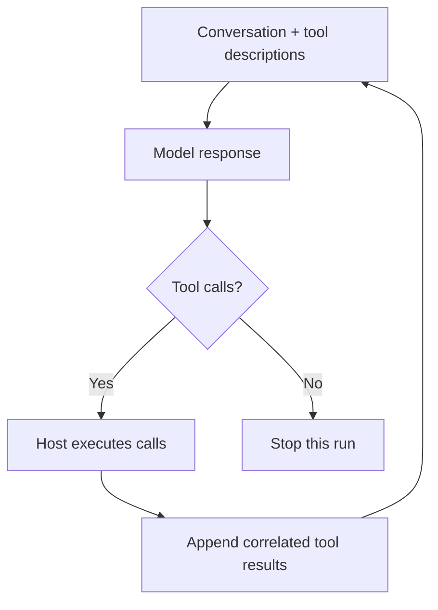

# 1. The smallest coding agent

Our task is to fix `add(2, 3)`, which returns `-1` instead of `5`. A model could
guess the cause from that sentence. A coding agent should be able to inspect the
implementation and act on what it finds.

In this chapter we build the loop that makes that possible. By the end, you can
run an interaction, trace a failed read into the next request, and distinguish
the model deciding to stop from the code actually being fixed.

## 1. The model decides; the host executes

The model receives a conversation and descriptions of available tools. It returns
an assistant message that may contain tool calls. Each call has an identifier, a
tool name, and arguments. The host executes it and adds the result to the next
request.

The model does not call Python directly. A tool call is data until the host
validates and dispatches it.



A **turn** is one model response plus its requested tool executions. A **run** is
the sequence of turns started by this invocation. The **conversation** is the
history we supply to each request. These lifetimes happen to fit inside one
function here; a resumable agent will separate them.

Text and tool calls are not mutually exclusive. An assistant can say “I’ll read
the function” and request a read in the same response. In this first loop, a
response with no tool calls ends the run. That is a stopping rule, not proof of
task completion.

## 2. Build the loop

The full implementation is in
[`examples/crafting_agents/core.py`](https://github.com/whanyu1212/Wisp/blob/main/examples/crafting_agents/core.py).
Its small dataclasses represent messages, tool calls, tool descriptions, and the
run result. The provider contract is:

```python
async def complete(history: Sequence[Message], tools: Sequence[ToolSpec]) -> Message:
    ...
```

`ToolSpec` describes a tool with named, required string arguments. It is a compact
teaching contract; a live adapter will need to translate it to the provider's tool
schema. The executor is a separate callable that accepts a decoded `ToolCall`.

```python
{{#include ../../examples/crafting_agents/core.py:loop}}
```

Follow the normal path from top to bottom:

1. Ask the provider for a complete response using the current history and tools.
2. Retain the assistant's message, including its requested calls.
3. Execute calls sequentially, attaching each observation to its call ID.
4. Send those observations back on the next turn.

The call ID matters even when two calls have the same tool name. It answers
“which request produced this result?” Retaining the assistant's calls before
their results preserves the exchange the next request needs to see.

`ToolFailure` means an expected operational failure, such as a missing file.
Turning it into an observation gives the model a chance to recover. Unexpected
programming errors propagate instead of being disguised as ordinary tool errors.
The turn limit is reported distinctly so a caller does not mistake exhaustion
for a normal finish.

The optional `instructions` parameter is empty in this checkpoint. Chapter 3
uses it to prepend host-assembled context before the user message.

This checkpoint is an async request loop, **not token streaming**: its scripted
`complete()` returns one whole response. Chapter 4 will stream inside that
provider boundary while keeping the loop's complete-response contract. The
`report` callback prints a trace for us; it does not drive the conversation. Tool
execution is synchronous at this checkpoint.

## 3. Supply a repeatable model decision

For now, our “repository” is one in-memory file:

```python
def add(a, b):
    return a - b
```

The read executor exposes only `calculator.py`. Our scripted provider first asks
for the wrong path, then the right one, then returns a diagnosis:

```python
{{#include ../../examples/crafting_agents/checkpoint_01.py:script}}
```

Each `after` condition checks the preceding observation before yielding the next
response. The script is not learning from the error; we authored that behavior.
It lets us verify that the host preserves the feedback a real model would need.
If the observation differs, the checkpoint fails rather than printing a scripted
success regardless of what happened.

From the checkout root, run:

```bash
python3 -m examples.crafting_agents.checkpoint_01
```

The important parts of the trace are:

```text
turn 1: Locate the function.
call 1: read {'path': 'sum.py'}
result 1: error: use read with path='calculator.py'
turn 2: Try the path from the error.
call 2: read {'path': 'calculator.py'}
result 2: def add(a, b):
    return a - b

turn 3: add subtracts b. It needs addition; no file has been changed.
stopped: model_finished
```

There were three model turns and two tool calls. The final response contains no
tools, so the run ends. Nothing has been edited or tested. This is why our result
says `model_finished`, not `task_succeeded`.

## 4. Break an assumption

Change the `run_agent` invocation in `checkpoint_01.py` to pass `max_turns=1`.
The read error is still retained, but the next request never happens. The final
line becomes `stopped: turn_limit`.

Now consider a different interruption: the process exits after retaining a tool
call but before recording its result. The next request could contain an incomplete
exchange. A working demo loop does not yet solve that problem. Persistence and
transcript repair will need an explicit owner.

Other missing guarantees are deliberate next steps:

- Argument validation and real file operations belong to chapter 2.
- Partial streamed arguments must not execute before completion; the provider
  chapter will introduce that boundary.
- Cancellation needs resource cleanup as well as a stopping flag.
- A real provider may reject history or require provider-native continuation
  state. The portable message types here do not erase those differences.

## 5. Wisp's choice: separate the lifetimes

Wisp's [runtime architecture](../architecture/agent-runtime.md) separates three
owners that our example combines:

| Owner | Responsibility |
| --- | --- |
| `run_agent_loop` | Turns, model streaming, tool batches, and transient continuation state within one invocation |
| `AgentHarness` | In-memory conversation and user queues across invocations |
| `CodingSession` | Durable history, compaction, trust, and session policy |

The loop receives a base history and yields typed events such as `MessageDelta`,
`MessageCompleted`, `ToolExecutionEnded`, and `TurnCompleted`. It does not append
to the caller's input message sequence. The harness retains completed messages
and tool executions; the session adds durability.

This is a stateful, effectful execution mechanism with a bounded responsibility—not
a pure function. It calls providers and tools and tracks state during the run.
Its separation is useful because frontends can observe progress without owning
the model/tool cycle, and session storage can evolve without being embedded in
that cycle.

The cost is coordination: events must arrive in a valid order, transcript updates
must agree with the next provider request, and cancellation must settle owned
resources. A single object holding conversation and execution state is simpler
for a small one-shot script. Wisp pays the extra coordination cost to support
resumable sessions and multiple interfaces.

Two distinctions will matter later:

- **Prompt caching and native continuation are different mechanisms.** Caching
  can reduce repeated processing or cost while still requiring a full request
  payload. Native continuation can use provider-held response state. Provider
  adapters must preserve the semantics of each.
- **Batching does not establish dependencies by itself.** Our loop runs tools
  sequentially. Wisp's prepared executor allows concurrency only for batches whose
  calls are all marked parallel-safe; otherwise it runs sequentially. The scheduling
  policy, not the existence of a turn, keeps an edit before a dependent test.

### Follow the implementation

- [`loop/runner.py`](https://github.com/whanyu1212/Wisp/blob/main/src/wisp/agent/loop/runner.py):
  start at `run_agent_loop` for the normal turn lifecycle.
- [`harness/runner.py`](https://github.com/whanyu1212/Wisp/blob/main/src/wisp/agent/harness/runner.py):
  start at `AgentHarness._run` for retaining the conversation across runs.
- [`test_runtime_invariants.py`](https://github.com/whanyu1212/Wisp/blob/main/tests/agent/test_runtime_invariants.py):
  see how observable runtime contracts are tested.

## 6. Checkpoint

You should now be able to answer:

1. Why must a tool result retain its call ID?
2. Why is a failed read useful input to the next request?
3. Why does “the model stopped” not imply “the task succeeded”?

**Exercise:** add a second failed read to the script before the successful one.
Give it a distinct call ID and an `after` condition. The trace should contain
four turns, three correlated results, and the same final diagnosis. Then lower
the turn budget and verify that the diagnosis is never emitted.

Next: [Reading, editing, and testing code](02-tools.md). We will keep this loop
and replace the in-memory read with operations on a disposable project.
