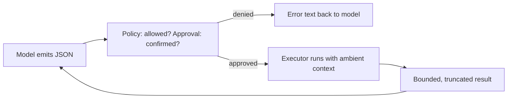

# Chapter 2: Giving the Model Hands - Tools, Filesystem & Safety

A model without tools can only describe work. It cannot do work. Tools are what turn a chatbot into a coding agent: read a file, edit it, run the tests, search the repo.

But hands are also how an agent causes damage. Every tool is a place where untrusted model output meets your filesystem and your shell. This chapter is about that boundary: how to define it, how to keep it safe, and where the naive version breaks.

---

## 1. First Principles: What a Tool Actually Is

Strip away the framework marketing and a tool is three things:

1. **A schema** the model can see (name, description, JSON parameters). This is the only part the model ever touches.
2. **An executor** the model can never see (your code, running with your privileges). It receives parsed arguments and returns text.
3. **A policy** that sits between them deciding whether a given call may run, and whether a human must confirm first.

The schema and the executor must stay on opposite sides of a serialization boundary. The model produces JSON; it never gets a file descriptor, a shell handle, or a Python callable. If you blur that line, prompt injection becomes remote code execution.

Two distinctions matter more than newcomers expect:

- **Policy vs. approval.** Policy is static and silent: "this session may use `read` but not `bash`". Approval is interactive: "this session may use `bash`, but ask me each time". Conflating them gives you either a nagging agent (everything needs a click) or a reckless one (one `--yes` flag disables all judgment).
- **Failures vs. crashes.** A tool failure (file not found, test failed, bad regex) is information the model can act on. An executor crash (uncaught exception, hung subprocess, corrupted transcript) is not. The contract must convert the first kind into text and prevent the second kind structurally.



Ambient context is the quiet fourth piece: working directory, output budgets, secret lists, write scopes. The model never sets these. They ride along with every call so each tool behaves consistently without trusting the caller.

---

## 2. From Scratch: A Minimal Tool Boundary in ~60 Lines

Here is the smallest version that still respects the boundary above. A frozen result type, a protocol with a safety label, a context the model cannot touch, and an executor that turns every failure into text.

```python
import asyncio
from dataclasses import dataclass, field
from typing import Any, Protocol

class ToolError(Exception):
    def __init__(self, message: str, *, retryable: bool = False,
                 hint: str | None = None):
        super().__init__(message)
        self.retryable = retryable
        self.hint = hint

@dataclass(frozen=True)
class ToolResult:
    text: str
    data: dict[str, Any] = field(default_factory=dict)
    truncated: bool = False

@dataclass(frozen=True)
class ToolContext:
    cwd: str
    max_output_bytes: int = 50_000
    max_output_lines: int = 2_000
    protected_paths: tuple[str, ...] = (".env", "*.key")

class Tool(Protocol):
    name: str
    description: str
    input_schema: dict[str, Any]
    safety: str  # "read" | "mutating" | "command"
    async def run(self, args: dict[str, Any], ctx: ToolContext) -> ToolResult: ...

async def execute_tool(tool: Tool, args: dict[str, Any], ctx: ToolContext,
                       *, approved: bool) -> ToolResult:
    """Policy gate plus failure-to-text conversion."""
    if tool.safety in ("mutating", "command") and not approved:
        return ToolResult(
            text=f"Tool {tool.name} needs approval before it can run.",
            data={"approved": False},
        )
    try:
        result = await tool.run(args, ctx)
    except ToolError as exc:
        hint = f" Hint: {exc.hint}" if exc.hint else ""
        return ToolResult(text=f"Error: {exc}{hint}",
                          data={"retryable": exc.retryable})
    except Exception as exc:  # executor bug: never let it crash the loop
        return ToolResult(text=f"Internal tool error in {tool.name}: {exc}",
                          data={"retryable": False})
    # Bound the wire: truncate runaway output before it reaches history.
    encoded = result.text.encode("utf-8")
    if len(encoded) > ctx.max_output_bytes:
        cut = ctx.max_output_bytes
        return ToolResult(text=encoded[:cut].decode("utf-8", "ignore")
                          + "\n[truncated]",
                          data=result.data, truncated=True)
    return result
```

Note what this buys you. The model picks a name and JSON args; everything else (cwd, budgets, secrets, approval state) comes from `ToolContext`. `ToolError` carries a machine-readable `retryable` flag and a human hint so the model can self-correct instead of guessing. And the `except Exception` at the bottom is deliberate: a buggy tool must degrade into an error string, never into a dead agent loop.

What it does *not* buy you is the subject of the next section.

---

## 3. Production Realities: Where the Toy Boundary Breaks

**Symlink and TOCTOU races.** The toy checks a path string, then opens it. Between the check and the open, the filesystem can change: a `src/config.py` that was a regular file becomes a symlink to `/etc/passwd`. Any path check done on strings is advisory. The fix is to open directories and files by descriptor (`O_NOFOLLOW`, `dir_fd`), never following links, and to re-validate identity (device + inode + version) after opening.

**Non-atomic writes.** `open(path, "w")` truncates first and writes second. A crash, cancellation, or concurrent reader in between leaves a half-written file. Production writes go to a temp file in the same directory, fsync, then atomically rename over the target, preserving permissions and extended attributes.

**Unbounded output.** `cat huge.log` or `rg pattern monorepo` can return gigabytes. Without byte *and* line caps, one call blows the context window and the RPC wire to the UI. Every tool needs budgets, truncation flags, and ideally a count of dropped bytes so the model knows it saw a prefix, not the whole.

**Hanging processes.** A synchronous `run("pytest")` with no timeout is a denial-of-service against yourself. Real shell tools need start/poll/cancel: launch in the background, stream bounded increments, kill the tree on cancel or lifetime expiry.

**Regex denial-of-service.** A pathological pattern (`(a+)+$`) on a large repo can spin a CPU for minutes inside what looks like an innocent read-only call. Mitigations are timeouts per match attempt plus a `literal=true` escape hatch for exact-text search.

**Secret leakage through search.** Ignore-style exclusions (`--glob '!...'`) use glob semantics that differ from your secrets policy, and a caller-supplied glob can re-include an excluded file. The secrets check must be authoritative and applied per emitted record, failing closed: if a record's path cannot be parsed unambiguously, drop it.

**Approval fatigue and scope.** A binary "approve all mutating tools" switch trains users to click yes. What you want is scoping (which directories, which operations, create-only vs. overwrite) but each knob adds UI and protocol surface.

---

## 4. Case Study: How Wisp Does It

Wisp keeps seven built-in tools, deliberately few: `read`, `write`, `edit`, `bash`, `grep`, `find`, `ls` (`src/wisp/tools/builtin.py`). Breadth is a liability at this layer; each tool is a maintained attack surface.

### The contract

`src/wisp/tools/base.py` defines the `Tool` protocol: `name`, `description`, `input_schema`, `safety`, and `run(arguments, context) -> ToolResult`. Safety is one of `read`, `mutating`, or `command`. `ToolResult` carries `text` (what the model sees), `data` (structured fields for the UI and tests), and `truncated`.

Three small types split responsibilities that toys tend to merge:

- `ToolPolicy` (`src/wisp/tools/policy.py`) answers "may this run at all?" with allow-all, allow-read-only, or allow-by-name.
- `ToolApprovalPolicy` (`src/wisp/tools/approval.py`) answers "must a human confirm?" Anything `mutating` or `command` requires approval unless its name or safety class was pre-approved.
- `ToolContext` (`src/wisp/tools/context.py`) carries the ambient facts: `cwd`, output budgets (50,000 bytes / 2,000 lines by default), `allow_outside_cwd`, write scopes, and `protected_paths` that default to secrets (`.env`, keys, credential and settings files) unless explicitly emptied.

Errors are typed, not stringly: `ToolError(message, failure_code, retryable, recovery_hint)` with `ToolArgumentError` for schema-valid but value-invalid calls (`src/wisp/tools/result.py`). An edit against stale text, for example, returns `failure_code="stale_input"`, `retryable=True`, and tells the model to reread the range first. That is the failure-as-observation idea from Chapter 1, implemented at the tool layer.

### Files: paranoia with a purpose

`src/wisp/tools/files/secure_fs.py` opens everything component-by-component from the filesystem root with `O_NOFOLLOW` and descriptor-relative calls. No operation follows a symlink, on either POSIX or Windows (which gets its own junction-aware path).

On top of that, `src/wisp/tools/files/operations.py` adds:

- `read` with 1-indexed offset/limit slicing done inside the secured open, so paging a 10,000-line file never loads it whole.
- `write` via temp-file plus atomic rename, preserving mode/ownership/xattrs, snapshotting the prior text (capped at 1M chars so the diff does not flood the TUI event wire), and refusing symlinks, hard-link surprises, and mid-write replacements detected via version checks.
- `edit` requiring every `oldText` to match exactly once, with replacements applied only if they do not overlap. Concurrent modification between open and replace aborts instead of silently merging.

The cost is visible in the line count: the file tools are an order of magnitude larger than their schemas suggest. Most of those lines are Windows branches, metadata preservation, and race handling. That ratio is normal for this layer.

### Shell: background by default

`BashTool` (`src/wisp/tools/shell/tool.py`) supports `run`, `start`, `poll`, and `cancel` against a shared `ProcessSupervisor`. A bare `run` gets a 30-second default timeout; `start` launches a resumable process with a lifetime cap and yields incremental bounded output on each `poll`. Every response reports `exit_code`, separate stdout/stderr truncation flags, and dropped-byte counts so the model can tell a complete log from a prefix. Output retention itself lives partly in Rust (see below).

### Search: two engines, one policy

`GrepTool`/`FindTool`/`LsTool` (`src/wisp/tools/search/tools.py`) walk with open directory descriptors, skip hidden names and symlinks, honor `.gitignore`/`.ignore`/`.rgignore` plus `.git/info/exclude`, and cap directories at 100,000 entries and ignore files at 1M bytes / 10,000 patterns. Binary detection (NUL bytes), incremental UTF-8 decoding, a 1M-character per-line ceiling, and a 50ms per-pattern regex timeout keep one bad file or pattern from stalling the walk.

Literal case-sensitive grep can dispatch per-file scanning to the optional native `wisp-search` Rust extension (`scan_literal_fd` over an already-open descriptor, so the security properties do not change). Anything else (regex, case-insensitive, unrepresentable inputs) stays on the Python engine, and sandbox failures fall back transparently. Protected-path filtering then runs on every emitted record regardless of engine, failing closed on ambiguous parses.

### Execution: validated lifecycles, two-phase batches

Between the model and the tools sits a validated event lifecycle (`src/wisp/agent/loop/tool_execution.py`). Each call must produce its events in order: approval requested before approval resolved, exactly one terminal `ToolExecutionEnded`, never a success after a denial, never anything after the terminal event. Violations raise `ToolExecutionProtocolError` instead of reaching the provider. Argument payloads are deep-copied at each boundary so an executor cannot mutate the record the transcript keeps.

`PreparedToolExecutor` (`src/wisp/agent/loop/prepared_tools.py`) splits approval from side effects: prepare every call first (surfacing approval requests with zero side effects), then run. Calls marked `parallel_safe` run concurrently up to 8 at a time with results re-ordered into source order; if any call is not parallel-safe the batch goes sequential. This preserves causality for the common `write` then `test` pattern while still parallelizing independent reads. Truncated model responses (finish reason `length`) never execute: each call gets a synthetic retryable error telling the model to re-issue complete arguments.

---

## 5. Effectiveness Review: What the Built-ins Get Right, and Where They Fall Short

**Done well.**

- *Small surface, typed contract.* Seven tools behind one protocol with JSON schemas and safety labels is easy to audit. Adding an eighth tool is a conscious decision, not an accident.
- *Secure by default.* Descriptor-relative opens, no symlink following, secrets protected on every construction path, atomic writes with version checks. The defaults protect a careless integrator.
- *Everything is bounded.* Bytes, lines, directory entries, ignore files, line lengths, regex time. Truncation flags and dropped-byte counts travel with results instead of being silently cut.
- *Errors the model can use.* Failure codes plus retryable plus recovery hint turn "it broke" into "reread the file and retry". That single design choice removes a whole class of error loops.
- *Policy and approval separated.* Non-interactive `--yes` flows, per-name pre-approval, and interactive confirmation compose instead of collapsing into one switch.
- *Executor bugs become protocol errors.* The lifecycle validator catches ordering and identity mistakes in custom executors before they corrupt provider history.

**Lacking, or worth doing better.**

- *No undo or multi-file transactions.* `write` returns a before-snapshot for display, but there is no first-class revert, and a batch that edits five files can leave three applied when the fourth fails. Agents work around this with git, but the tool layer itself is not atomic across files.
- *Exact-match editing only.* `edit` refuses fuzzy or multi-occurrence replacements, which is safe but pushes the model into read-modify-write cycles (and token spend) for mechanical renames a patch-oriented tool could do in one call.
- *Coarse approval scopes.* Write scoping (`allowed_write_paths`, create-only, non-empty) exists but is operation-level, not path-pattern-level. "Auto-approve writes under `notes/`, always ask under `src/`" is the granularity users actually want.
- *Search has no ranking.* Results are source-ordered with caps, not relevance-ordered. On a large repo the model sees the first N matches, which rewards lucky file layout over good retrieval.
- *Fragmented process accounting.* The default `BashTool` supervisor caps at one process while search tools construct their own supervisors; global concurrency and memory budgets are emergent rather than enforced in one place.
- *No cost or timing telemetry on results.* `ToolResult` reports text and truncation but not duration, bytes scanned, or per-call timing attribution, which makes performance regressions in agent workflows hard to attribute.

None of these are oversights so much as trade-offs of keeping the surface small. Each addition (revert, patch, ranked search, scoped approvals) would expand schemas, UI, and tests. The honest question for your own agent is which of these your users will hit first.

---

## 6. Why Rust, Where, and What It Costs

Rust appears in three places around the tools: `wisp-search` (bounded literal grep over open descriptors), `wisp-process-text` (incremental decoding and bounded retention for process output), and the `wisp-tui` frontend that renders tool results. All three crates set `#![forbid(unsafe_code)]`: the goal is speed *with* safety invariants, not speed instead of them.

**What Rust buys here.** Python's GIL makes throughput-bound scanning (walk a 100k-file repo, match every line) effectively single-threaded, and per-character Python loops over process output are slow precisely when output is flooding fastest. The native scanners release the GIL, scan with byte-oriented routines, enforce line/byte/match budgets inside the hot loop, and hand a bounded result back. Cancellation is a shared atomic flag rather than a cooperative `await` that may not arrive while Python is busy decoding.

**What it costs.** First, builds: PyO3/maturin wheels, per-platform CI, and a pure-Python fallback path that must keep working when the extension is absent. Second, parity: every semantic (binary detection, line-boundary rules, truncation accounting, dropped-byte math) now exists twice, and the Python side carries dispatch, validation, and fallback code to keep the accelerator transparent. That is why the native path is deliberately narrow (literal, case-sensitive grep only): the narrower the fast path, the smaller the parity surface. Regex and case-folded search stay in Python where the `regex` crate-equivalent semantics would be hardest to duplicate exactly.

**The rule of thumb.** Reach for Rust when a tool operation is (a) on the hot path of every agent turn (search, process-output retention, terminal rendering), (b) bounded and byte-oriented rather than policy-heavy, and (c) measurable faster in a benchmark, not just plausibly faster. Keep policy (approvals, secrets, path checks), error shaping, and orchestration in Python where iteration speed and readability dominate. Wisp's split follows that line: Rust scans bytes and retains text; Python decides what may run and what the model hears back.

---

## Summary

- A tool boundary is a schema the model sees, an executor it never sees, a policy gate between them, and ambient context the model never sets.
- Tool failures are observations; executor crashes must be structurally impossible, or at least converted to error text.
- Production file tools need descriptor-relative opens, atomic writes, and version checks. Production shell tools need start/poll/cancel with bounded output. Production search needs ignore handling, binary safety, regex limits, and fail-closed secret filtering.
- Wisp's seven built-ins pair a small typed contract with heavy runtime guarantees, validated lifecycles, and two-phase parallel-safe batches. Its gaps (no undo, exact-match edits, unranked search, coarse approvals) are the price of that small surface.
- Rust accelerates bounded byte work (literal grep, output retention, TUI rendering) while Python keeps policy and orchestration. The native path stays narrow so the parity burden stays manageable.

**Exercise.** Extend the scratch `execute_tool` with a per-tool timeout and a `parallel_safe` flag: run two safe reads concurrently, but force a `write` followed by a `test` command to run sequentially. Then add a `protected_paths` check to the search path that drops records failing closed.

Next: **[Chapter 3: Context Windows & Compaction](./index.md)** (token budgets and structured memory, coming soon).
