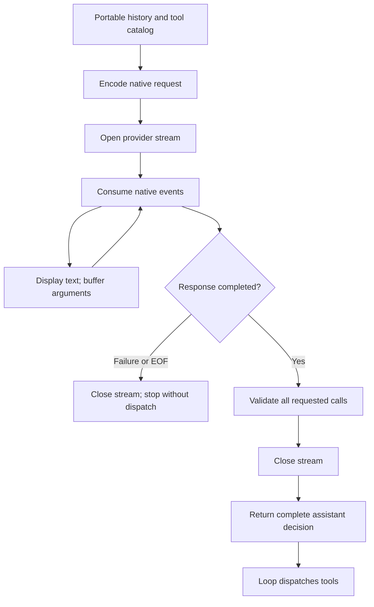

# 4. Talking to models reliably

Our agent has tools and useful context, but every decision so far has been
scripted. This chapter connects the same loop to a streaming provider. The new
problem is deciding when the provider has supplied a **complete decision**, rather
than merely some promising text or a fragment of tool arguments.

We will implement one narrow OpenAI Responses adapter, exercise it with offline
event replays, and expose an opt-in live command. The important invariant is:

> A complete, validated response can request an action. An incomplete response
> cannot accidentally execute one.

## 1. Keep the loop; replace the provider boundary

The loop still calls:

```python
response = await provider.complete(history, tools)
```

Inside that call, the adapter can open an HTTP stream, display text fragments,
buffer tool arguments, and validate completion. Only then does it return the
assistant `Message` that the loop may append and execute.



This keeps the early chapters' execution contract intact while adding genuine
streamed progress. Our `report` callback is still just an observer. Displaying a
text delta does not append a completed assistant turn or authorize a tool.

The implementation is split by responsibility:

- [`responses.py`](https://github.com/whanyu1212/Wisp/blob/main/examples/crafting_agents/responses.py):
  native request encoding, response assembly, and the completion boundary.
- [`openai_transport.py`](https://github.com/whanyu1212/Wisp/blob/main/examples/crafting_agents/openai_transport.py):
  optional SDK connection and error classification.
- [`stream_replay.py`](https://github.com/whanyu1212/Wisp/blob/main/examples/crafting_agents/stream_replay.py):
  authored native-shaped event fixtures.
- [`checkpoint_04.py`](https://github.com/whanyu1212/Wisp/blob/main/examples/crafting_agents/checkpoint_04.py):
  fixture setup, offline scenarios, and the live entry point.

## 2. Translate meaning, not just field names

Our teaching messages are not a provider's wire format. Responses represents
function calls and results as separate input items:

| Teaching value | Responses request representation |
| --- | --- |
| System, user, or assistant text | An input message with `role` and `content` |
| Assistant `ToolCall` | A `function_call` item with `call_id`, `name`, and JSON-encoded `arguments` |
| Tool observation | A `function_call_output` item with the matching `call_id` and string `output` |
| `ToolSpec` | A function definition with a JSON schema for its parameters |

Notice two details. The call ID survives the translation, and the argument object
becomes a **JSON string** in a function-call item. Tool results follow the calls
that requested them, just as in our portable conversation.

The catalog's named string parameters become a strict schema. An edit's parameter
schema is:

```json
{
  "type": "object",
  "properties": {
    "path": {"type": "string"},
    "old": {"type": "string"},
    "new": {"type": "string"}
  },
  "required": ["path", "old", "new"],
  "additionalProperties": false
}
```

The adapter still validates received arguments locally. A schema sent upstream
does not replace the host's validation or filesystem permissions.

### Choose a deliberately small replay contract

Each request sends the full portable history with `store=False`. We do not use a
server-side `previous_response_id`. This is easy to inspect, but it repeats the
history on every request and only preserves the content represented by our
teaching messages.

That last limitation matters. Some models produce provider-native reasoning
items that must participate in continuation. This adapter rejects unsupported
output items instead of silently discarding them. The documented live example is
[GPT-4.1 mini](https://developers.openai.com/api/docs/models/gpt-4.1-mini), a
non-reasoning model with streaming and function calling. It is a protocol-teaching
choice, not a recommendation for the best coding model.

Generalizing to reasoning models requires a native replay or continuation design,
not merely changing the model name. Wisp's richer approach appears later in the
chapter.

## 3. Progress is not completion

A function call arrives across several events:

```text
response.created
response.output_item.added               name=edit, arguments=""
response.function_call_arguments.delta   {"path": "calcu
response.function_call_arguments.delta   lator.py", ...}
response.function_call_arguments.done
response.output_item.done
response.completed
```

The argument fragments can end anywhere. Attempting `json.loads()` on each one
would turn ordinary streaming into a series of parse failures. Instead, collect
the fragments under the item's identity:

```python
{{#include ../../examples/crafting_agents/responses.py:events}}
```

The accumulator displays text immediately and reports argument-buffer progress
without executing anything. It limits accumulated text previews, per-call
argument characters, and the number of pending calls. These checks bound our
retained data; they do not cap an HTTP frame before the SDK decodes it.

`response.function_call_arguments.done` means that one argument string is done.
`response.output_item.done` means that one output item is done. Neither says the
whole response succeeded. A later `response.incomplete`, `response.failed`, or
connection loss still invalidates this response as an execution decision.

### Validate the whole response before releasing any call

At `response.completed`, `_completed()` checks:

- The response ID and successful status agree with the opened response.
- Terminal calls match the IDs, names, and bytes buffered from the stream.
- Call identities are nonempty and unique; no buffered call was omitted.
- Every requested tool is exposed, its JSON parses as an object, and its exact
  argument names and string values match the catalog.
- Output items belong to the text/function-call subset the adapter can replay.

Only after validating **all** calls does it return a `Message`. A valid first
edit followed by malformed second-call arguments does not partially execute.

This checkpoint stops on malformed model arguments. A more capable agent can
record a structured failure observation and let the model reissue a valid call,
but that recovery must preserve the call/result exchange. Ordinary operational
failures—such as a stale exact-match edit—still become tool observations through
our existing executor.

## 4. Put retries around opening, not around the whole run

Here is the boundary the loop actually awaits:

```python
{{#include ../../examples/crafting_agents/responses.py:boundary}}
```

Only acquiring a stream sits inside the retry loop. After a stream is acquired,
an empty stream, partial text, malformed arguments, or transport exception fails
this response without another attempt—even if no visible text has arrived yet.
There are at most three opening attempts, with short exponential delays and
jitter. Offline replay skips the wall-clock wait while retaining the attempt
sequence.

The SDK transport classifies network failures and HTTP 5xx responses during
opening as retryable. It stops on other HTTP statuses, including 401 and 429.
This deliberately conservative policy avoids treating every rate/quota rejection
as transient; it does not yet implement `Retry-After` handling.

The SDK client has `max_retries=0`, so there is one retry owner. Layering SDK
retries underneath application retries would obscure the real attempt count.
The client uses a 30-second SDK timeout and each request allows 2,048 output
tokens. The timeout bounds SDK I/O waits, not the total lifetime of the run.

An opening retry does not repeat a local tool call, because the loop has not
received a decision yet. It is **not** a guarantee of exactly-once upstream
processing or billing: a connection failure may occur after the provider received
the request.

### Closing is part of finishing

The `finally` block closes the acquired stream on success, failure, or task
cancellation. Python completes that cleanup before returning the accepted
message. If cleanup itself fails, the loop does not proceed to tool dispatch.
The live entry point also closes its owned SDK client.

This is provider-resource ownership, not a complete cancellation design. The
fixture tools still execute synchronously. Interactive cancellation and process
supervision will require additional mechanisms in later chapters.

## 5. Run the offline failure laboratory

These commands require only Python 3.12+ and the checkout. They import no SDK,
read no API credentials, and make no network requests:

```bash
python3 -m examples.crafting_agents.checkpoint_04
python3 -m examples.crafting_agents.checkpoint_04 --scenario retry
python3 -m examples.crafting_agents.checkpoint_04 --scenario disconnect
python3 -m examples.crafting_agents.checkpoint_04 --scenario malformed
python3 -m examples.crafting_agents.checkpoint_04 --scenario output-limit
```

| Scenario | What happens | What to inspect |
| --- | --- | --- |
| `repair` | Chapter 3's repair decisions are delivered as native-shaped streamed events | Discovery and read observations, failing then passing tests, final addition fix |
| `retry` | The first opening attempt fails, then the repair runs | `retry opening: attempt 2/3`, followed by one execution of each scripted operation |
| `disconnect` | Complete-looking arguments and item-done events arrive, but the stream ends before response completion | Provider failure, zero executed tools, unchanged source |
| `malformed` | Streamed and terminal argument bytes agree, but are invalid JSON | Validation failure before dispatch, unchanged source |
| `output-limit` | The provider reports `response.incomplete` with `max_output_tokens` | No execution, even though the buffered edit looks complete |

The three intentional failure demonstrations exit with status zero only after
observing the expected provider failure without tool execution. That means the
**demonstration passed**, not that the agent fixed the bug. Unexpected success or
tool execution causes the checkpoint to fail. The live command instead returns
a nonzero status for provider failures or turn-budget exhaustion.

These events are authored fixtures, not recorded live sessions. They exercise
the same request serializer and event assembler used by the live path. Separate
tests drive the actual OpenAI SDK with mocked HTTP/SSE responses to check the
transport seam without credentials.

## 6. Opt into a live model

From the development checkout, install the locked dependencies with
`uv sync --locked`. Supply `OPENAI_API_KEY` in your environment, then run:

```bash
uv run python -m examples.crafting_agents.checkpoint_04 --live --model gpt-4.1-mini
```

This sends the generated fixture's context and subsequent observations to the
OpenAI API and can incur API charges. It defaults to **discovery and reading**;
the model is asked to inspect the bug and explain a fix. It has no scripted next
decision or expected answer.

To permit an actual repair and test run:

```bash
uv run python -m examples.crafting_agents.checkpoint_04 --live --model gpt-4.1-mini --allow-execution
```

The flag both exposes the extra tools and enables a separate host-side gate:

```python
{{#include ../../examples/crafting_agents/checkpoint_04.py:permission}}
```

The test tool executes edited Python with the host process's privileges. A
temporary directory keeps the demonstration separate from your checkout, but is
not an OS sandbox. This explicit opt-in is necessary because the code is now
model-selected rather than a known scripted replacement. Chapter 5 will develop
the side-effect boundary further.

Every run creates a new fixture and removes it afterward, printing the final
source. Chapter 3's deliberately permission-granting instruction is replaced
with ordinary project guidance for this exercise. The loop has a ten-turn limit;
that limit and `model_finished` still do not establish task correctness. Inspect
the real tool results and final source.

**Verification scope:** the offline scenarios, validation regressions, and
mocked SDK transport are exercised by tests. A billed live-model repair is not
part of CI or evidence for these deterministic claims. Access to a chosen model
and the quality of its decisions must be checked in an actual live run.

## 7. Wisp's choice: native semantics inside adapters

Wisp's direct OpenAI provider also uses Responses, but it supports a broader
contract than this checkpoint. Start with
[`providers/openai.py`](https://github.com/whanyu1212/Wisp/blob/main/src/wisp/providers/openai.py):

- Native text and reasoning progress become distinct normalized events.
- Function calls are buffered; the adapter requires `response.completed` before
  publishing successful tool-call and response-completion events.
- Premature EOF, API failure, and incomplete responses produce a failed outcome
  with available partial text rather than silently committing buffered tools.
- Initial requests carry base history. Continued requests can use a native
  response ID and send only the new tool outputs and appended user messages.
- Provider usage is projected into typed usage data. A response cursor, prompt
  caching, token accounting, and tool-call IDs serve different purposes.

Native continuation costs more state management and provider-specific code, but
avoids pretending that every response can be faithfully reconstructed from plain
text and portable tool calls. Other providers need different replay rules. A
Chat Completions endpoint, for example, uses assistant `tool_calls` and `tool`
messages rather than Responses input items. Compatibility in tool names does not
make those histories interchangeable.

### A normalized stream still needs validation

[`loop/model_response.py`](https://github.com/whanyu1212/Wisp/blob/main/src/wisp/agent/loop/model_response.py)
adapts provider events into the loop's typed progress. Its
[`ProviderResponseLifecycle`](https://github.com/whanyu1212/Wisp/blob/main/src/wisp/agent/loop/provider_lifecycle.py)
checks start/terminal ordering, consistent response identity, matching streamed
and terminal tool lists, and finish reasons that agree with the presence of tools.
The loop's input sequence remains caller-owned; the harness handles conversation
retention across runs.

This extra layer catches invalid custom-provider behavior even when the adapter
claims success. It adds event types and validation code, but lets the shared loop
reason about one typed lifecycle without flattening native replay semantics.

### Retries stay provider-owned

[`wisp/retry.py`](https://github.com/whanyu1212/Wisp/blob/main/src/wisp/retry.py)
provides bounded backoff, jitter, retry-header parsing, and classification helpers.
The provider adapter decides where they apply. Wisp recognizes transient status
codes and distinguishes terminal quota errors from retryable rate limits. It
does not retry an already-started response, and Wisp-owned OpenAI clients disable
the SDK's implicit retries.

For incomplete tool arguments, Wisp can preserve parse-error information in its
typed tool-call contract. The loop also prevents execution of tool batches from
responses marked `length`, supplying synthetic retryable results. Those are
explicit recovery contracts, rather than a blanket retry around the model/tool
cycle. Our smaller adapter terminates these cases instead.

Relevant evidence lives in
[`tests/providers/test_openai.py`](https://github.com/whanyu1212/Wisp/blob/main/tests/providers/test_openai.py)
and
[`tests/docs/crafting/test_providers.py`](https://github.com/whanyu1212/Wisp/blob/main/tests/docs/crafting/test_providers.py).
The OpenAI [function-calling guide](https://developers.openai.com/api/docs/guides/function-calling#streaming)
documents the native argument-fragment events used in this chapter.

## 8. Checkpoint

**Exercise 1: separate item completion from response completion.** Run
`--scenario disconnect`. Find the item-done events in the fixture and explain why
they do not authorize the edit. Verify that tool execution stays at zero.

**Exercise 2: validate the batch before executing it.** Build a response with a
valid edit followed by an invalid second tool call. The valid first call must
not execute. Change the second call to valid arguments and confirm that the
complete response can be accepted.

**Exercise 3: test the retry boundary.** Move a simulated network failure from
the opening function into stream iteration. The opening failure may retry;
the acquired-stream failure must close and terminate without a second request.

Run the checkpoint regressions with:

```bash
uv run pytest tests/docs/crafting/test_providers.py
```

Next: [Controlling side effects](05-side-effects.md). The
model can now make real decisions. We need to strengthen how those decisions meet
the filesystem, command execution, trust, and user approval.
