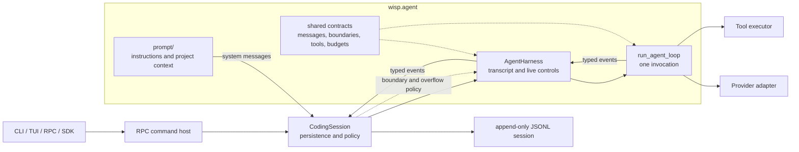

# Agent runtime

`wisp.agent` contains the provider-neutral core of Wisp's agent runtime. It builds the model's
instructions, keeps an in-memory conversation across requests, and runs the model/tool cycle. The
CLI, TUI, RPC, and SDK all reach this code through the same `CodingSession` path.

The package root intentionally re-exports nothing. Import the public `harness`, `loop`, and `prompt`
APIs from their package roots, and shared contracts from the module that defines them.

## Big picture



Each layer adds one concern:

| Layer | Lifetime | Owns |
| --- | --- | --- |
| `CodingSession` | Durable conversation | Persistence, compaction orchestration, project context, trust, safety, and cost accounting |
| `AgentHarness` | Across calls in one process | In-memory transcript, steering and follow-up queues, cancellation, and synchronization with session policy |
| `run_agent_loop` | One invocation | Provider turns, context estimates, tool batches, and transient continuation state |
| Provider adapter | One provider protocol | Native request, streaming, replay, continuation, and usage semantics |

This distinction is important because a **conversation**, an **invocation**, and a **turn** are not
the same thing:

- A conversation may contain many user prompts and survive process restarts through a session.
- An invocation is one `prompt()`, `prompt_message()`, or `continue_()` stream on `AgentHarness`.
- A turn is one provider response plus its requested tool batch, if any. `TurnCompleted` ends a turn,
  not necessarily the invocation.

## How one invocation runs

```mermaid
sequenceDiagram
  participant Session as CodingSession
  participant Prompt as prompt builder
  participant Harness as AgentHarness
  participant Loop as run_agent_loop
  participant Provider as Provider adapter
  participant Tools as Tool executor

  Session->>Prompt: Build ordered system messages
  Prompt-->>Session: Instructions and bounded project context
  Session->>Harness: Configure with system messages and restored history
  Session->>Harness: Start prompt or continuation
  Harness->>Harness: Accept the user message
  Harness->>Loop: Start with detached provider history

  Loop->>Provider: Stream one response
  Provider-->>Loop: Deltas, tool calls, usage, terminal outcome
  Loop-->>Harness: Message lifecycle events
  Harness->>Harness: Retain completed assistant message

  opt Response requests tools
    Loop->>Tools: Execute tool batch
    Tools-->>Loop: Approval, execution, and result events
    Loop-->>Harness: Tool lifecycle events
    Harness->>Harness: Retain terminal tool output
  end

  Loop-->>Harness: TurnCompleted
  Harness->>Harness: Drain eligible steering or follow-up messages
  Loop->>Harness: Ask before the next provider request
  Harness->>Session: Ask session policy when configured
  Session-->>Harness: Stop, continue, replace, or rebase
  Harness-->>Loop: Boundary decision

  opt Another turn starts
    Loop-->>Harness: TurnStarted
    Harness->>Harness: Apply accepted transcript transition
  end

  Harness-->>Session: Continue the typed event stream
  Session->>Session: Persist durable events and update accounting
```

Completed assistant messages and terminal tool outputs are added to the harness transcript before
their events are exposed to a caller. This keeps resumable state intact even if the caller closes the
stream immediately after observing an event.

The loop does not mutate its input `messages`. It keeps only the continuation data needed within the
current invocation: the provider cursor, pending tool results, injected user messages, and the
assistant/tool tail produced so far.

## Request boundaries and live input

After a completed turn, the loop consults the request-boundary hook before sampling the provider
again. A decision can:

| Decision field | Effect |
| --- | --- |
| `stop` | End the invocation; this takes precedence over every other field. |
| `extra_messages` | Inject plain user messages into the continued request. |
| `messages` | Replace the portable history and clear native continuation. |
| `context_rebase` | Replace the portable base while retaining an accepted native continuation tail. |

The harness uses this boundary for live input:

- **Steering** is eligible after every successfully completed turn and has priority.
- **Follow-up** is eligible only when a tool-free turn would otherwise stop.
- Both queues are FIFO and may drain one message or the current queue snapshot, depending on their
  configured mode.

`CodingSession` also uses the same handshake for compaction and context-overflow recovery. The loop
applies the decision to its next provider request; the harness waits for the matching `TurnStarted`
before applying the transcript transition. That delay keeps provider-visible and harness-visible
history synchronized.

## Package map

| Path | Responsibility |
| --- | --- |
| [`prompt/`](./prompt/) | Builds ordered system instructions, trusted or untrusted project context, tool guidance, and plan-mode restrictions. Start with `builder.build_prompt_messages`. |
| [`harness/`](./harness/) | Owns the transcript across invocations, live queues, cancellation, and boundary coordination. Start with `runner.AgentHarness._run`. |
| [`loop/`](./loop/) | Implements the provider/tool cycle and emits ordered events for one invocation. Start with `runner.run_agent_loop`. |
| [`messages.py`](./messages.py) | Defines provider-facing `Message` and compaction records, and projects completion events into detached transcript rows. |
| [`request_boundary.py`](./request_boundary.py) | Defines snapshots, replace/rebase decisions, and boundary and overflow hook protocols. |
| [`tool_contracts.py`](./tool_contracts.py) | Defines ordinary and prepared tool-executor protocols and their lifecycle errors. |
| [`context_budget.py`](./context_budget.py) | Estimates request context, records provider observations, and builds context-pressure budgets. |
| [`history.py`](./history.py) | Normalizes historical tool exchanges into provider-safe portable history. |
| [`transcript_repair.py`](./transcript_repair.py) | Orders tool results and synthesizes missing results after interrupted tool calls. |
| [`mode.py`](./mode.py) | Defines build and plan modes and plan-mode instructions. |
| [`validation.py`](./validation.py) | Validates limits shared by harness and loop configuration. |

## Where a change belongs

| Change | Start here |
| --- | --- |
| System instructions or project-file discovery | [`prompt/`](./prompt/) |
| Transcript retention, queues, or cancellation across calls | [`harness/`](./harness/) |
| Turn sequencing, provider stream validation, or tool scheduling | [`loop/`](./loop/) |
| Provider-specific request or continuation behavior | [`wisp/providers/`](../providers/) |
| Persistence, compaction policy, permissions, or approvals | [`wisp/coding/`](../coding/) |
| Observable event schemas | [`wisp/events/`](../events/) |

Avoid moving policy downward for convenience. In particular, `run_agent_loop` must stay independent
of durable sessions and frontends, while provider-specific behavior must not be flattened into the
shared loop.

## Public imports

```python
from wisp.agent.harness import AgentHarness, AgentHarnessConfig
from wisp.agent.loop import AgentLoopConfig, run_agent_loop
from wisp.agent.prompt import build_prompt_messages

from wisp.agent.messages import Message
from wisp.agent.request_boundary import RequestBoundaryDecision
```

Within these subpackages, import private collaborators from their defining modules rather than from
new compatibility shims.

## Further reading

- [Agent runtime architecture](../../../site/architecture/agent-runtime.md) describes the same
  boundaries in the project documentation.
- [Harness README](./harness/README.md) covers transcript ownership, queues, cancellation, boundary
  synchronization, invariants, and focused tests.
- [Loop README](./loop/README.md) covers turn execution, continuation state, event-order invariants,
  and focused tests.
- [`tests/agent/`](../../../tests/agent/) contains the agent-core regression suites.
